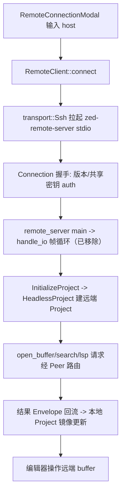

# Deep Reference: remote & rpc & proto

> 参考手册级：远程开发（SSH/WSL/Docker）由 `crates/remote`（**客户端侧连接**）、`crates/remote_connection`（**连接 UI**）与传输/协议底座 `crates/rpc` + `crates/proto` 协作。原服务端 `crates/remote_server`（**headless 进程**）已从本 fork 移除（提交 `移除remote_server`），第 3 节仅作历史参考。核心思想：**UI 永远在本地，Project 逻辑跑在远端 `HeadlessProject`，两侧以 `Envelope` 协议消息双向镜像**。

## 1. `crates/remote`：客户端连接层 [`remote_client.rs`](../crates/remote/src/remote_client.rs)
| 类型 | 位置 | 角色 |
|---|---|---|
| `struct RemoteClient` | [L329](../crates/remote/src/remote_client.rs) | 本地持有到远端 server 的 `AnyProtoClient`+`Peer`；`connect`/`disconnect`、`prepare_for_new_connection`、维护 `user_project_paths` |
| `enum ConnectionState` | [L308](../crates/remote/src/remote_client.rs) | `Disconnected`｜` Connecting`｜`WaitingForAuth`｜`WaitingForServer`｜`WaitingForLogin`｜`Connected` |
| `enum RemoteClientEvent` | [L340](../crates/remote/src/remote_client.rs) | `ConnectionStateChanged`/`Disconnected`/`WaitingForPasswordPrompt`/`PromptForServerVersion`… |
| `enum RemoteConnectionOptions` | [L1330](../crates/remote/src/remote_client.rs) | `Ssh(SshConnectionOptions)`｜`Wsl(...)`｜`Docker(...)` |
| `struct RemotePlatform`/`enum RemoteOs`/`RemoteArch` | L114/L56/L93 | 远端 OS/arch（决定下载哪个 server 二进制） |
| `struct CommandTemplate` / `enum Interactive` | L120/L128 | 启动命令模板 |
| `struct OpenWslPath` | [L1612](../crates/remote/src/remote_client.rs) | WSL 路径解析 |
传输实现 [`transport/`](../crates/remote/src/transport)：
| 文件 | 类型 |
|---|---|
| [ssh.rs](../crates/remote/src/transport/ssh.rs)(大) | `SshConnectionOptions`(L137)/`SshConnectionHost`(L59)：`ssh`+`stdin/stdout` 跑 server，端口转发，`ProxyCommand` |
| [wsl.rs](../crates/remote/src/transport/wsl.rs) | `WslConnectionOptions`(L37)：Windows 下经 WSL 发行版 |
| [docker.rs](../crates/remote/src/transport/docker.rs) | `DockerConnectionOptions`(L48)：dev container |
| [mock.rs](../crates/remote/src/transport/mock.rs) | `MockRemoteConnection`(L65)/`MockConnectionRegistry`(L100)：测试 |
其它：[proxy.rs](../crates/remote/src/proxy.rs)（`ProxyLaunchError` 走 `crates/http_proxy`）、[remote_identity.rs](../crates/remote/src/remote_identity.rs)（`RemoteConnectionIdentity`）、[json_log.rs](../crates/remote/src/json_log.rs)（server stdout 日志）、[protocol.rs](../crates/remote/src/protocol.rs)（`MessageId`）。

## 2. `crates/remote_connection`：连接 UI
| 类型 | 位置 | 角色 |
|---|---|---|
| `struct RemoteConnectionModal` | [remote_connection.rs:47](../crates/remote_connection/src/remote_connection.rs) | onboarding/命令面板唤起的"Connect via SSH"弹窗 |
| `struct RemoteConnectionPrompt` | [L24](../crates/remote_connection/src/remote_connection.rs) | 密码/ passphrase 输入 |
| `struct SshConnectionHeader` | [L299](../crates/remote_connection/src/remote_connection.rs) | 目标主机展示 |
| `struct RemoteClientDelegate` | [L442](../crates/remote_connection/src/remote_connection.rs) | `impl Modal`，回调驱动 `RemoteClient` 状态机 |

## 3. `crates/remote_server`（已移除）：远端 headless 进程
| 文件 | 角色 |
|---|---|
| `crates/remote_server/src/main.rs` | server 二进制入口（`--socket-name`/`--daemon-dir`），由本地经 ssh stdio 拉起 |
| `crates/remote_server/src/server.rs`(49KB) | `enum Commands`(L63)、`handle_io`(L1183)（帧循环）、`SpawnServerError`(L1017)、`ExecuteProxyError`(L803)、socket/守护进程、`handle_settings_file_changes` |
| `crates/remote_server/src/headless_project.rs`(53KB) | **`HeadlessProject`**：无 UI 的 `Project`（[Project-Deep-Dive.md](Project-Deep-Dive.md)），在远端真正打开 worktree/buffer/lsp/git，响应 `Envelope` 请求 |
| `crates/remote_server/src/remote_editing_tests.rs`(149KB) | 端到端远程编辑测试 |
| `crates/remote_server/src/windows.rs` | Windows 特有（命名管道） |

## 4. 协议底座 `crates/rpc` + `crates/proto`
### rpc（传输/路由，无业务）
| 类型 | 位置 | 角色 |
|---|---|---|
| `struct Peer` | [peer.rs:60](../crates/rpc/src/peer.rs) | **消息路由核心**：按 `ConnectionId`/`PeerId` 收发 `Envelope`，`request`/`send`/订阅、pending requests（原 collab 服务端亦用，已移除） |
| `struct ConnectionId` | [L31](../crates/rpc/src/peer.rs) | `{owner_id, id}` |
| `trait ProtoClient` / `struct AnyProtoClient` | [proto_client.rs:58](../crates/rpc/src/proto_client.rs)/[L25](../crates/rpc/src/proto_client.rs) | 统一"可向对端收发 proto 消息"的抽象（本地↔remote、原本地↔collab 通用）；`ProtoMessageHandlerSet`(L90)、`EntityMessageSubscriber`(L180)、`NoopProtoClient`(L666) |
| `struct Connection` | [conn.rs:4](../crates/rpc/src/conn.rs) | 一条底层连接（reader/writer + 版本） |
| `struct MessageStream<S>` / `enum Message` | [message_stream.rs:15](../crates/rpc/src/message_stream.rs)/[L21](../crates/rpc/src/message_stream.rs) | 帧解析（长度前缀 + zlib） |
| `enum Notification` | [notification.rs:20](../crates/rpc/src/notification.rs) | 内部事件（`MarkedReached`/`TrailingMessages`/`Acked`） |
| `struct PublicKey`/`PrivateKey`、`EncryptionFormat` | [auth.rs:28](../crates/rpc/src/auth.rs) | RSA 握手加密共享密钥 |
`PROTOCOL_VERSION = 68`（[rpc.rs:19](../crates/rpc/src/rpc.rs)）——客户端/服务端版本必须匹配。
### proto（消息 schema）
`crates/proto` 由 `.proto` 生成 `Envelope` + 全部请求/响应/事件类型，含 `trait EntityMessage`（[typed_envelope.rs:23](../crates/proto/src/typed_envelope.rs)，把消息路由到某个 `Entity`）、常量 `REMOTE_SERVER_PEER_ID`/`REMOTE_SERVER_PROJECT_ID`（[proto.rs:19](../crates/proto/src/proto.rs)）。→ [Persistence.md](Persistence.md) 亦依赖 db crate，非 proto。

## 5. 建立远程会话（真实流程）

## 6. 与其它子系统的关系
- 远程模式复用同一 `Project`/`Worktree` 门面（远端是 `Worktree` 的 Remote 变体，见 [Project-Deep-Dive.md](Project-Deep-Dive.md)）。
- `ProtoClient` 抽象同时服务于**协作**（多人共享）——`crates/client`（原 `collab` 服务端已移除），见 [Collab-Deep-Dive.md](Collab-Deep-Dive.md)。
→ 概览页 [Remote-Development.md](Remote-Development.md)、[Collaboration-and-Call.md](Collaboration-and-Call.md)。
