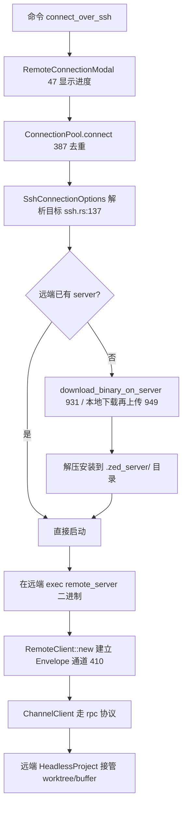

# Remote Development（SSH / WSL / Docker 远程编辑）

Zed 的远程开发把**编辑器 UI 留在本地**，把 `Project`（worktree、buffer、LSP、语言服务器、终端）跑在**远端主机**上，两端用与协作相同的 RPC（`Envelope` + proto 消息）通信。三个 crate 分工：

- [`remote`](../crates/remote)：客户端侧。定义 `RemoteConnection`/`RemoteClient` 与各传输（SSH/WSL/Docker/Mock），负责在远端**引导并启动** `remote_server` 二进制。
- [`remote_server`](../crates/remote_server)：远端侧，独立可执行文件（`main.rs`）。跑一个 `HeadlessProject`，处理来自客户端的 RPC 请求。
- [`remote_connection`](../crates/remote_connection)：连接过程的 UI（弹窗、进度、host 选择）。

RPC 底座见 [`rpc`](Collaboration-and-Call.md)（`ChannelClient`/`Peer`），与实时协作共用协议。

## 1. 分层职责

| 层 | 类型 | 位置 | 职责 |
|---|---|---|---|
| 连接抽象 | `RemoteConnection` trait | [`remote_client.rs`](../crates/remote/src/remote_client.rs) | 统一的远端连接接口（stdio/socket 通道） |
| 连接池 | `ConnectionPool` | [`remote_client.rs:387`](../crates/remote/src/remote_client.rs) | 全局按 options 去重复用连接 |
| 客户端 | `RemoteClient` | [`remote_client.rs:329`](../crates/remote/src/remote_client.rs) | 建立 `ChannelClient`，双向 `Envelope` 通道 |
| 平台 | `RemoteOs`/`RemoteArch` | [`remote_client.rs:56/93`](../crates/remote/src/remote_client.rs) | 远端 OS/架构（决定下载哪个 server 二进制） |
| SSH 传输 | `SshConnectionOptions` | [`ssh.rs:137`](../crates/remote/src/transport/ssh.rs) | `parse_command_line`(L1655)/`ssh_destination`(L1774)/`additional_args`(L1791) |
| WSL 传输 | `WslConnectionOptions` | [`wsl.rs:37`](../crates/remote/src/transport/wsl.rs) | Windows↔WSL 路径互转(L668/692) |
| Docker 传输 | `DockerConnectionOptions` | [`docker.rs:48`](../crates/remote/src/transport/docker.rs) | 容器内开发 |
| Mock | `MockRemoteConnection` | [`mock.rs:65`](../crates/remote/src/transport/mock.rs) | 测试用替身 |
| 连接 UI | `RemoteConnectionModal` | [`remote_connection.rs:47`](../crates/remote_connection/src/remote_connection.rs) | 进度/密码/取消弹窗 |
| 委托 | `RemoteClientDelegate` | [`remote_connection.rs:442`](../crates/remote_connection/src/remote_connection.rs) | 提供 set_status、本地下载 server 等能力 |
| 远端主体 | `HeadlessProject` | [`headless_project.rs`](../crates/remote_server/src/headless_project.rs) | 无 UI 的 Project，处理 RPC |
| 远端入口 | `fn main` | [`main.rs:24`](../crates/remote_server/src/main.rs) | remote_server 可执行文件入口 |

## 2. 连接与引导流程

1. **发起**：`connect_with_modal`（[remote_connection.rs:560](../crates/remote_connection/src/remote_connection.rs)）弹出 `RemoteConnectionModal`；`connect_reusing_pool`（L610）优先复用已有连接。入口 `RemoteClient::connect`（[remote_client.rs:381](../crates/remote/src/remote_client.rs)）转交全局 `ConnectionPool`（L387）。
2. **解析主机**：SSH 走 `SshConnectionOptions::parse_command_line`（[ssh.rs:1655](../crates/remote/src/transport/ssh.rs)）拆 `user@host:port`，`ssh_destination`（L1774）/`additional_args`（L1791）拼实际命令行；WSL/Docker 类似。
3. **引导 server 二进制**：先在远端查 `.zed_server/`；缺失时 `download_binary_on_server`（ssh.rs:931，让主机自下）或回退 `download_server_binary_locally`（[remote_client.rs:150](../crates/remote/src/remote_client.rs)）本地下载再 scp 上传、`extract_and_install`（wsl.rs:392）。若设了 `ZED_BUILD_REMOTE_SERVER`，则 `build_remote_server_from_source` 从源码现编（ssh.rs:869）。下载哪个包由远端 `RemoteOs`/`RemoteArch` + `release_channel` 决定。
4. **握手**：`RemoteClient::new`（[L410](../crates/remote/src/remote_client.rs)）建 `outgoing/incoming: mpsc<Envelope>`，本地侧 `ChannelClient::new`（L425，来自 rpc）把 stdio 上的报文转成 RPC；`has_active_connection`（L399）供上层决定是否要先弹密码框。

## 3. 远端侧：HeadlessProject

远端 `remote_server` 二进制（main.rs:24）启动后进入 GPUI **headless** 模式，核心是 [`HeadlessProject`](../crates/remote_server/src/headless_project.rs)——一个没有界面的 `Project`。它把客户端请求映射为具体操作：

- `handle_add_worktree`（[L508](../crates/remote_server/src/headless_project.rs)）/ `handle_remove_worktree`（L596）
- `handle_open_buffer_by_path`（L610）/ `handle_open_image_by_path`（L638）/ `handle_open_new_buffer`（L841）
- `handle_trust_worktrees`（L703）/ `handle_restrict_worktrees`（L727）/ `handle_download_file_by_path`（L749）
- `handle_ping`（L1254）保活

语言服务器、诊断、搜索等仍在远端 `Project` 内跑，结果经 RPC 回传本地渲染。`server.rs` 的 `handle_settings_file_changes`（[L1272](../crates/remote_server/src/server.rs)）同步设置。

## 4. 与实时协作的关系

远程开发和"多人协作"底层同源：都用 [`rpc`](Collaboration-and-Call.md) 的 `Peer`/`ChannelClient` 与 proto `Envelope`。区别在于——协作是 *多客户端 ↔ collab 服务器 ↔ 共享 Project*；远程开发是 *单本地客户端 ↔ 远端 HeadlessProject*。`mock.rs` 的 `MockRemoteConnection`（L65）让这条链路能在无网络下测试，思路与 livekit 的 mock 一致（见 [Collaboration-and-Call.md](Collaboration-and-Call.md)）。

## 5. 关键符号速查

| 符号 | 位置 | 作用 |
|---|---|---|
| `RemoteClient::connect` | `remote/src/remote_client.rs:381` | 建立远端连接总入口 |
| `ConnectionPool` | `remote_client.rs:387` | 连接去重复用 |
| `RemoteClient::new` | `remote_client.rs:410` | 建 Envelope 通道 + ChannelClient |
| `download_server_binary_locally` | `remote_client.rs:150` | 本地拉取 server 二进制 |
| `SshConnectionOptions` | `remote/src/transport/ssh.rs:137` | SSH 目标与参数 |
| `SshConnectionOptions::parse_command_line` | `ssh.rs:1655` | 解析 user@host:port |
| `download_binary_on_server` | `ssh.rs:966` | 让远端主机自下 server |
| `WslConnectionOptions` | `remote/src/transport/wsl.rs:37` | WSL 连接 |
| `RemoteConnectionModal` | `remote_connection/src/remote_connection.rs:47` | 连接进度/交互弹窗 |
| `connect_with_modal` | `remote_connection.rs:560` | 带弹窗的连接入口 |
| `HeadlessProject::handle_add_worktree` | `remote_server/src/headless_project.rs:508` | 远端挂载 worktree |
| `remote_server::main` | `remote_server/src/main.rs:24` | 远端可执行入口 |

## 6. 与其他页面的关系
- RPC 协议与 `Peer`/`Envelope`：[Collaboration-and-Call.md](Collaboration-and-Call.md)。
- 远端跑的正是 `Project`/worktree：[Project-Panel-and-FS.md](Project-Panel-and-FS.md)、[Language-and-Project.md](Language-and-Project.md)。
- SSH 远端终端：[Terminal.md](Terminal.md)。
- SSH 远端调试重连：[Debugger.md](Debugger.md)。
