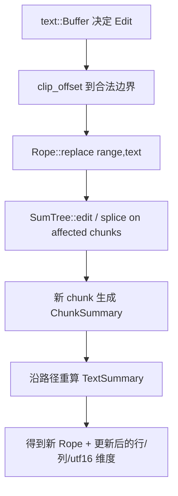

# Deep Reference: rope

> 参考手册级：`crates/rope` 的全部公开类型与方法。`Rope` = `SumTree<Chunk>`（见 [Sum-Tree-Deep-Dive.md](Sum-Tree-Deep-Dive.md)），是 Zed 文本的**底层字符序列**，被 [`text`](Text-Buffer-Deep-Dive.md) 持有。核心能力：O(log n) 切片/编辑 + **多坐标系互转**（UTF-8 offset ↔ `Point`(row,col) ↔ UTF-16）。

## 1. 坐标体系类型（跨文件）
| 类型 | 位置 | 含义 |
|---|---|---|
| `struct Point { row: u32, column: u32 }` | [`point.rs:9`](../crates/rope/src/point.rs) | 行列（0-based），最常用屏幕坐标 |
| `struct PointUtf16 { row, column }` | [`point_utf16.rs:7`](../crates/rope/src/point_utf16.rs) | UTF-16 列（LSP 需要） |
| `struct OffsetUtf16(pub usize)` | [`offset_utf16.rs:4`](../crates/rope/src/offset_utf16.rs) | UTF-16 偏移 |
| `struct Unclipped<T>(pub T)` | [`unclipped.rs:5`](../crates/rope/src/unclipped.rs) | 标记"未裁剪到合法边界"的偏移/点 |
| `struct DimensionPair<K,V>` | [`rope.rs:1594`](../crates/rope/src/rope.rs) | 二维 `Dimension`（如行→列联合定位） |

`Point` 辅助（[point.rs](../crates/rope/src/point.rs)）：`new`(L26)、`row_range`(L30)、`zero`(L40)、`parse_str`(L44)、`is_zero`(L53)、`saturating_sub`(L57)。

## 2. 摘要：`TextSummary` / `ChunkSummary`
| 类型 | 位置 | 内容 |
||---|---|
| `struct TextSummary` | [L1282](../crates/rope/src/rope.rs) | 一段文本的聚合：`lines`/`chars`/`utf16(cups)`/`text` 等 |
| `struct ChunkSummary` | [L1266](../crates/rope/src/rope.rs) | 单个 chunk 的摘要 |

`TextSummary` 实现 `Summary`，其**多个 `Dimension`**（`usize`=char offset、`Point`=row/col、`OffsetUtf16`、`PointUtf16`、`Line`）就是 rope 能在任意坐标系 O(log n) 定位的原因（`TextDimension` trait）。`summary<D: TextDimension>()`（[L745](../crates/rope/src/rope.rs)）取任一维度。

## 3. `Chunk`：叶子节点
[`chunk.rs`](../crates/rope/src/chunk.rs)（结构 [L17](../crates/rope/src/chunk.rs)）
- 内部：文本 `Arc<str>`/`Cow` + `TextSummary` + 位图（记录哪些字节是换行/空格/tab/多字节起始），支撑快速 `clip`/`line` 计算。
- `struct ChunkSlice<'a>`（[L218](../crates/rope/src/chunk.rs)）：chunk 的子切片视图。
- `Chunk::lines()`（[L347](../crates/rope/src/chunk.rs)）：该 chunk 内 `Point`。
- `struct Tabs` / `TabPosition`（[L685](../crates/rope/src/chunk.rs)/[L691](../crates/rope/src/chunk.rs)）：tab 展开到列宽的位置计算（渲染缩进用）。
- `clip_point(point, bias)`（chunk.rs:587）/`len`（L335）。

## 4. `Rope`：主类型全 API
[`rope.rs`](../crates/rope/src/rope.rs)（结构 [L26](../crates/rope/src/rope.rs)）

### 4.1 构造 / 长度
`new`(L31)、`summary()`→`TextSummary`(L312)、`len()`→UTF-8 字节(L316)、`is_empty`(L320)、`max_point`(L324)、`max_point_utf16`(L328)。

### 4.2 字符边界安全（多字节）
`is_char_boundary(offset)`(L42)、`assert_char_boundary::<PANIC>`(L54)、`floor_char_boundary`(L82)、`ceil_char_boundary`(L93)、`clip_offset(offset,bias)`(L536)。
> 这些保证编辑/切片不会落在 UTF-8 码点中间——所有来自 UI/CRDT 的偏移都先 `clip`。

### 4.3 迭代 / 读取
| 方法 | 位置 | 产出 |
|---|---|---|
| `chars()` | [L336](../crates/rope/src/rope.rs) | 全量 `char` 迭代 |
| `chars_at(start)` | [L340](../crates/rope/src/rope.rs) | 从偏移正向 |
| `reversed_chars_at(start)` | [L344](../crates/rope/src/rope.rs) | 反向（退格/词界扫描） |
| `reversed_bytes_in_range(range)` | [L353](../crates/rope/src/rope.rs) | `Bytes` 反序字节 |
| `chunks()` | [L357](../crates/rope/src/rope.rs) | `Chunks` 迭代（渲染按 chunk 取文本） |
| `chunks_in_range(range)` | [L361](../crates/rope/src/rope.rs) | 区间 chunk |
| `reversed_chunks_in_range(range)` | [L365](../crates/rope/src/rope.rs) | 反序区间 chunk |
| `lines()` | [L1017](../crates/rope/src/rope.rs) | `Lines` 逐行文本迭代 |

### 4.4 坐标转换（LSP / 选区关键）
`offset_to_offset_utf16(offset)`(L369)、`offset_utf16_to_offset(OffsetUtf16)`(L383)。配合 `point_for_offset`/`offset_for_point`/`clip_point` 构成 offset↔Point↔UTF-16 三向映射。

### 4.5 编辑 / 切片
| 方法 | 位置 | 说明 |
|---|---|---|
| `append(rope)` | [L104](../crates/rope/src/rope.rs) | 末尾拼接（`SumTree::append`） |
| `push(text)` | [L147](../crates/rope/src/rope.rs) | 追加 &str（自动分 chunk/重平衡） |
| `push_front(text)` | [L276](../crates/rope/src/rope.rs) | 头插（构造 diff 上下文用） |
| `replace(range, text)` | [L124](../crates/rope/src/rope.rs) | 就地区间替换（内部 `splice`） |
| `slice(range)` | [L134](../crates/rope/src/rope.rs) | 取子 `Rope`（O(log n)，结构共享） |
| `slice_rows(range)` | [L140](../crates/rope/src/rope.rs) | 按行区间取子 rope |
| `Cursor::slice(end)` / `summary(end)` | [L711](../crates/rope/src/rope.rs)/[L745](../crates/rope/src/rope.rs) | 游标式增量切片/摘要 |

### 4.6 游标与迭代器类型
`struct Cursor<'a>`(L678，rope 专用轻量游标)、`Chunks<'a>`(L798)、`ChunkWithBitmaps<'a>`(L1062)、`ChunkBitmaps<'a>`(L786)、`Bytes<'a>`(L1107)、`Lines<'a>`(L1186)。

## 5. 一次"编辑"在 rope 层的流程

历史快照 = 直接持有旧 `Rope`（`Arc` COW，不拷贝）。

## 6. 不变量与注意
- 所有偏移参数默认按 **UTF-8 char 边界**；`Unclipped` 包装者表示调用方保证合法。
- `Bias::Left/Right` 决定 clip 方向（选区起点用 Right、终点用 Left 等）。
- tab 不参与 `Point.column` 的字符计数——列是"字符数"，实际像素列由渲染层按 `Tabs`/tab_size 计算。

## 7. 与其他 Deep 页的关系
- 树底座：[Sum-Tree-Deep-Dive.md](Sum-Tree-Deep-Dive.md)。
- 持有 rope 的 CRDT buffer：[Text-Buffer-Deep-Dive.md](Text-Buffer-Deep-Dive.md)。
- 折叠多 buffer：[Multi-Buffer-Deep-Dive.md](Multi-Buffer-Deep-Dive.md)。
- 概览版：[Data-Structures.md](Data-Structures.md)。
