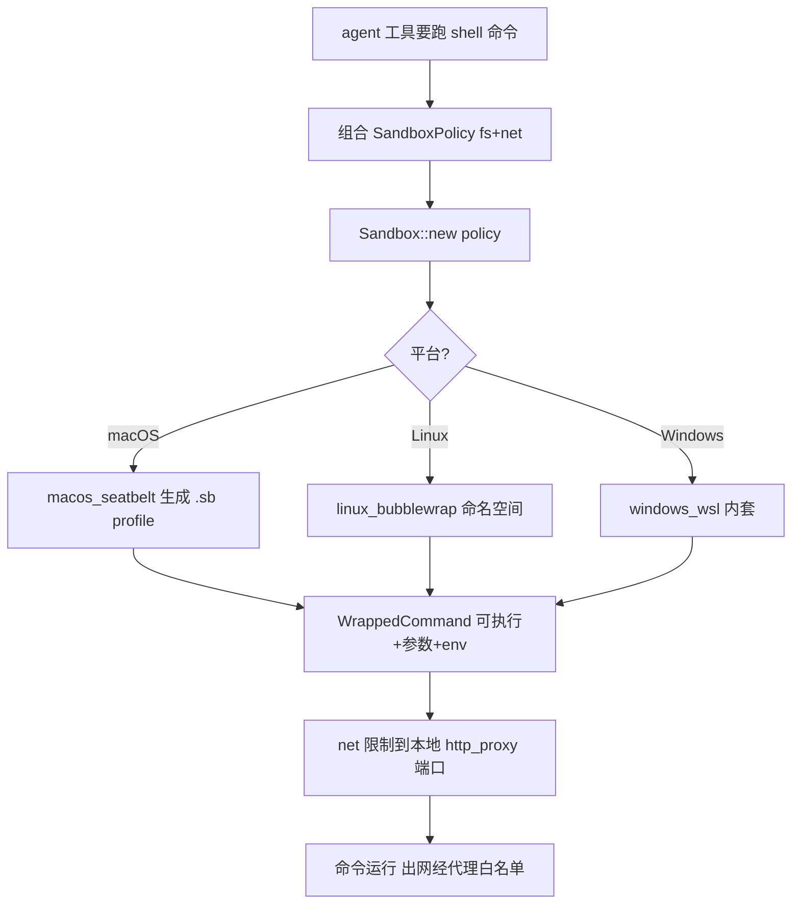

# 沙箱 / 凭据 / 环境支撑 深入解析（Deep Dive）

> 本页覆盖四个"安全与运行环境"支撑 crate：`sandbox`（Agent 命令的 OS 级隔离：seatbelt/bubblewrap/WSL）、`credentials_provider`（凭据读写抽象 trait）、`askpass`（无头密码/GPG 交互回环）、`dev_container`（VS Code devcontainer 解析与 Docker 启动）。它们共同保障"命令隔离 + 密钥安全 + 远程/容器环境"。

## 1. 分层设计

- **命令隔离层** `sandbox`：根据 `SandboxPolicy`（文件系统 + 网络策略）把待执行命令包装成平台原语——macOS `macos_seatbelt`（生成 `.sb` profile）、Linux `linux_bubblewrap`（bwrap 命名空间）、Windows `windows_wsl`（WSL 内套 seatbelt）。`http_proxy`（见 Network-HTTP 页）实现其网络白名单。
- **凭据抽象层** `credentials_provider`：`trait CredentialsProvider`（read/write/delete）让 `git`/`copilot` 等以同一接口读写密码；真实实现在平台密钥链（macOS Keychain / Windows CredentialManager / Secret Service）。
- **交互取密层** `askpass`：当 git/ssh 需要密码或 GPG passphrase 时，起一个临时"SSH_ASKPASS 脚本 + socket"回环（`AskPassSession`/`PasswordProxy`），把 GUI 弹窗结果以 `EncryptedPassword` 安全回传给子进程。
- **容器环境层** `dev_container`：解析 `devcontainer.json`（`devcontainer_manifest.rs` 416KB 为完整 schema）、调 `docker.rs` 构建/启动容器，产出远程连接所需信息交给 `remote_server`。

## 2. 类型总览

### sandbox（sandbox.rs，58KB）

| 符号 | 文件:行 | 角色 |
| --- | --- | --- |
| `struct SandboxFilesystemLocation(PathBuf)` | :56 | 被授权/保护的宿主路径 |
| `struct SandboxPolicy` | :85 | 顶层策略（fs + net + env） |
| `enum SandboxFsPolicy` | :92 | 文件系统读写范围 |
| `enum SandboxNetPolicy` | :110 | 网络策略（禁/仅代理/全放） |
| `fn merge(self, other)` | :166 | 策略合并 |
| `fn with_protected_paths(..)` | :175 | 追加保护路径 |
| `struct CommandAndArgs` | :375 | 待包装命令 |
| `struct WrappedCommand` | :391 | 包装结果（可执行 + 参数 + env） |
| `enum SandboxError` | :400 | 不支持/创建失败 |
| `struct Sandbox` | :485 | 沙箱句柄 |
| `fn new(policy)` | :519 | 依平台创建 |
| `fn can_create(policy)` | :585 | 可行性预检 |
| `fn run_sandbox_launcher_if_invoked()` | :954 | 辅助进程 launcher |
| 平台实现 | `macos_seatbelt.rs`/`linux_bubblewrap.rs`/`windows_wsl.rs` | 各 OS 落地 |

### credentials_provider / askpass / dev_container

| 符号 | 文件:行 | 角色 |
| --- | --- | --- |
| `trait CredentialsProvider` | credentials_provider.rs:11 | read/write/delete_credentials |
| `fn read_credentials(url, cx)` | :13 | 按 url 取密 |
| `fn write_credentials(url,user,pwd,cx)` | :20 | 存密 |
| `enum AskPassResult` | askpass.rs:40 | 取密结果 |
| `struct AskPassDelegate` | :51 | GUI 侧回调 |
| `fn ask_password(prompt)` | :94 | 弹框取密→`Task<Option<EncryptedPassword>>` |
| `struct AskPassSession` | :109 | 一次 askpass 会话（脚本+socket） |
| `fn script_path`/`socket_path`/`gpg_wrapper_path` | :228/:248/:234 | 暴露给子进程的环境 |
| `struct PasswordProxy` | :253 | 常驻密码代理 |
| `struct EncryptedPassword` | encrypted_password.rs:22 | 内存加密态密码 |
| `fn decrypt(IKnowWhatIAmDoing..)` | encrypted_password.rs:66 | 显式知情解锁 |
| `struct DevContainerContext` | dev_container/lib.rs:98 | 解析后的容器上下文 |
| `async fn environment(cx)` | dev_container/lib.rs:126 | 容器 env→HashMap |

## 3. 核心方法与调用锚点

**沙箱构建（sandbox.rs）**
- `SandboxPolicy { fs: SandboxFsPolicy(:92), net: SandboxNetPolicy(:110), .. }` 由调用方（多为 `agent` 的工具执行）组合；`merge`(:166) 叠加、`with_protected_paths`(:175) 保护敏感路径（如 `~/.ssh`）。
- `Sandbox::new(policy)`(:519) 按平台分派到 `macos_seatbelt`/`linux_bubblewrap`/`windows_wsl`，产出 `WrappedCommand`(:391)（真正的可执行 + 前缀参数 + 注入 env）；`can_create`(:585) 先探测内核/工具是否可用，不可用返回 `SandboxError`(:400)。
- 网络侧：`SandboxNetPolicy` 与 `http_proxy::Allowlist` 配合——命令被限制只能连本地代理端口，代理再执行主机名白名单。

**凭据读写（credentials_provider.rs）**
- 只有 `trait CredentialsProvider`(:11) 三个方法：`read_credentials`(:13)/`write_credentials`(:20)/`delete_credentials`(:29)，均以 `url` 为主键、返回 `Box<dyn Future>`。谁需要密码就注入一个实现（git 用系统密钥链，扩展用内存实现）。

**askpass 回环（askpass.rs）**
- `AskPassSession::new_with_cancellation`(:70) 建 socket + 写一个临时"askpass 脚本"（`script_path` :228），把 `SSH_ASKPASS`/`GPG_TTY` 指向它；子进程要密码时执行脚本→连 `socket_path`(:248)→`PasswordProxy`(:253) 收到请求→回调 `AskPassDelegate::ask_password`(:94) 弹 GUI→把 `EncryptedPassword`(encrypted_password.rs:22) 经 socket 回传。
- `EncryptedPassword::decrypt(..)`(encrypted_password.rs:66) 要求传入 `IKnowWhatIAmDoingAndIHaveReadTheDocs`(:63) 哨兵类型，强制调用方显式确认后才拿到明文——防误用。

**dev_container（lib.rs / docker.rs）**
- 解析 `devcontainer.json`（schema 在 `devcontainer_manifest.rs`），`DevContainerContext`(:98) 持有镜像/feature/run 参数；`environment(cx)`(:126) 汇总容器环境变量；`docker.rs`(54KB) 执行 build/up；结果交给 `remote_server` 在其内启动 Zed 远程服务。

## 4. 沙箱化命令执行流程

## 5. 集成点

- `agent`/`project` 的命令工具（terminal 执行）用 `sandbox` 包裹；策略来源是设置里的 agent 权限与 `SandboxPolicy`。
- `git` crate 通过 `credentials_provider` 读写远程仓库口令；`askpass` 被 `git`/`remote` 在无头场景调起（`SSH_ASKPASS`）。
- `remote_server`/`ssh_remote`（见 Remote-Deep-Dive）在 `dev_container` 起好的容器里安装并运行 Zed server。
- `http_proxy`（Network-HTTP 页）是 `sandbox` 网络策略的执行者。

## 6. 相关页

- [Network-HTTP-Deep-Dive](Network-HTTP-Deep-Dive.md)（`http_proxy` 网络白名单执行）
- [Remote-Deep-Dive](Remote-Deep-Dive.md)（`dev_container`/`remote_server` 衔接）
- [Git-Deep-Dive](Git-Deep-Dive.md)（`credentials_provider`/`askpass` 消费方）
- [Agent-Deep-Dive](Agent-Deep-Dive.md)（命令工具沙箱化执行）
