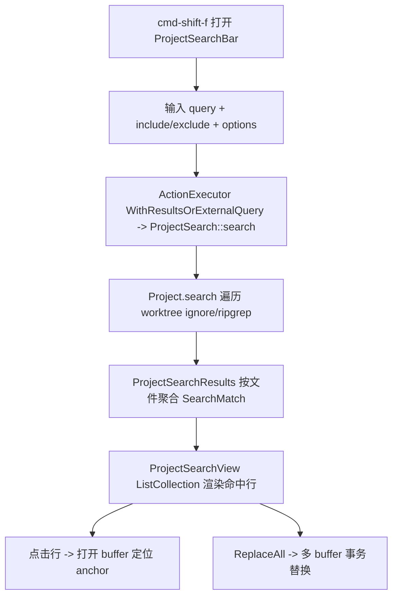

# Deep Reference: search

> 参考手册级：`crates/search`（**查找/替换 UI 层**，`project_search.rs` 371KB + `buffer_search.rs` 165KB）在 `crates/project` 的搜索能力（`ProjectSearchResults`/`SearchQuery`，见 [Project-Deep-Dive.md](Project-Deep-Dive.md)）之上，提供两种界面：**编辑器内查找条**（`BufferSearchBar`）与**项目搜索面板**（`ProjectSearchBar`/`ProjectSearchView`）。二者共享 `TextFinder` 抽象与 `registrar` 动作分发。

## 1. 类型总览 [`search.rs`](../crates/search/src/search.rs)
| 类型 | 位置 | 角色 |
|---|---|---|
| `enum SearchOption` | [search.rs:75](../crates/search/src/search.rs) | `CaseSensitive`/`WholeWord`/`IncludeIgnored`/`IncludeHidden`/`Regex`（搜索开关） |
| `enum SearchSource<'a,'b>` | [L88](../crates/search/src/search.rs) | 查询文本来源：buffer 选区 / 外部 query |
| `SearchKind`/`ActiveSearch`（`search.rs`） | | `Buffer`｜`Project`（当前哪种搜索占据查找条） |

## 2. 编辑器内查找 [`buffer_search.rs`](../crates/search/src/buffer_search.rs)(165KB)
| 类型 | 位置 | 角色 |
|---|---|---|
| `struct BufferSearchBar` | [L67](../crates/search/src/buffer_search.rs) | 编辑器顶部查找/替换条（`impl Render`+`impl Item`? 实为嵌在 editor 的搜索条）；`deploy`/`dismiss`、`search`/`replace`/`replace_all`、匹配导航、`SelectNext/SelectAll` |
| `enum Event` | [L57](../crates/search/src/buffer_search.rs) | `SelectedMatchChanged`/`SearchedFor`/`Focused`… |
`BufferSearchBar` 把 query 交给当前 `Editor` 的高亮（`Editor::search` 在 [Editor-Deep-Dive.md](Editor-Deep-Dive.md)），用 `text::Anchor` 标记所有匹配（[Text-Buffer-Deep-Dive.md](Text-Buffer-Deep-Dive.md)），替换走多 cursor/`Edit`。

## 3. 项目搜索 [`project_search.rs`](../crates/search/src/project_search.rs)(371KB)
| 类型 | 位置 | 角色 |
|---|---|---|
| `struct ProjectSearch` | [L254](../crates/search/src/project_search.rs) | 一次项目搜索的 `Entity`：持 `results: Entity<ProjectSearchResults>`（project 侧），把命中按文件聚合 |
| `struct ProjectSearchView` | [L362](../crates/search/src/project_search.rs) | 结果列表视图（`ListCollection` of `ProjectSearchResult`，展开文件→行；点击跳到 buffer） |
| `struct ProjectSearchSettings` | [L387](../crates/search/src/project_search.rs) | collapse-after-results 等 |
| `struct ProjectSearchBar` | [L392](../crates/search/src/project_search.rs) | 项目搜索输入条：query + `include`/`exclude` glob + `SearchOption` 组；`impl Render` |
| `enum ViewEvent` | [L1023](../crates/search/src/project_search.rs) | `Dismiss`/`SelectNext`/`SelectPrevious`/`ToggleFilters`/`Search`/`ReplaceAll`/`ReplaceInSelectedFiles`… |
搜索执行委托到 `Project::search`（[Project-Deep-Dive.md](Project-Deep-Dive.md) `search`）→ 底层 `project/src/search.rs`（ripgrep / `ignore` 遍历 worktree，产 `SearchResult`）。结果以多缓冲（[Multi-Buffer-Deep-Dive.md](Multi-Buffer-Deep-Dive.md)）呈现并可整体替换。

## 4. 共享的查找引擎 [`text_finder.rs`](../crates/search/src/text_finder.rs)(26KB)
| 类型 | 位置 | 角色 |
|---|---|---|
| `struct TextFinder` | [L31](../crates/search/src/text_finder.rs) | **可复用查找/替换核心**（Editor 的 `find_all`、列选替换等复用）：正则解析、match 迭代、`replacement` 展开（捕获组） |
| `struct TextFinderDb` | [L43](../crates/search/src/text_finder.rs) | SQLite 持久化最近查询（[Persistence.md](Persistence.md)） |
| `struct SearchMatch` | [L524](../crates/search/src/text_finder.rs) | 一处命中（range + replace 预览） |
| `struct Delegate`（[delegate.rs:61](../crates/search/src/text_finder/delegate.rs)） | | `TextFinder` 的宿主回调面（Editor / search bar 各实现其一） |

## 5. 动作注册 / 分发 [`buffer_search/registrar.rs`](../crates/search/src/buffer_search/registrar.rs)
查找条的 Action 需按"当前是 buffer 还是 project 搜索、是否已展开"路由到不同处理器：
| 类型 | 位置 | 角色 |
|---|---|---|
| `trait SearchActionsRegistrar` | [L7](../crates/search/src/buffer_search/registrar.rs) | 向 `key_context` 注册一批搜索动作 |
| `struct DivRegistrar<'a,'b,T>` | [L18](../crates/search/src/buffer_search/registrar.rs) | 绑定到某个 div 的注册器 |
| `struct PaneDivRegistrar` | [L61](../crates/search/src/buffer_search/registrar.rs) | 面向 Pane 的注册器 |
| `trait ActionExecutor<A>` | [L143](../crates/search/src/buffer_search/registrar.rs) | 执行一个动作 |
| `ForDismissed`/`ForDeployed`/`WithResultsOrExternalQuery` | [L154](../crates/search/src/buffer_search/registrar.rs)/[L179](../crates/search/src/buffer_search/registrar.rs)/[L205](../crates/search/src/buffer_search/registrar.rs) | 按搜索条状态选择回调（未展开/已展开/有结果或外部查询） |
其它：[search_bar.rs](../crates/search/src/search_bar.rs)(共享条布局)、[search_status_button.rs](../crates/search/src/search_status_button.rs)（`SearchButton`(L9) 状态栏入口）。

## 6. 一次项目搜索（真实流程）

编辑器内查找：`/`→`BufferSearchBar::deploy`→`Editor` 高亮所有 match→`SelectNext/All`→`replace`。

## 7. 相关页
概览 [Search.md](Search.md)；结果多缓冲 [Multi-Buffer-Deep-Dive.md](Multi-Buffer-Deep-Dive.md)；底层遍历 [Project-Deep-Dive.md](Project-Deep-Dive.md)；命令面板/文件查找 [Picker-and-Commands.md](Picker-and-Commands.md)。
