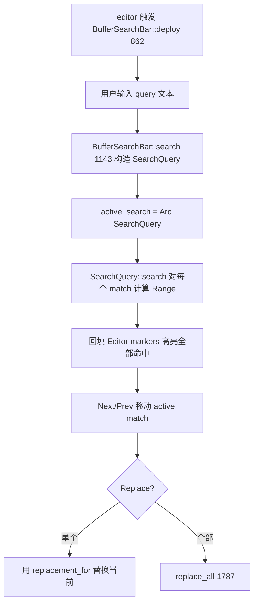
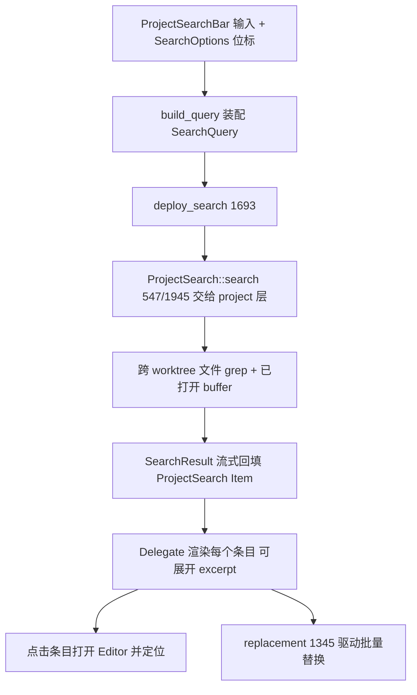

# Search（缓冲区查找 / 项目全局搜索 / 替换）

Zed 的搜索分两条独立链路：**缓冲区查找**（当前编辑器内的 `find`，`Cmd-F`）与**项目全局搜索**（跨文件 `grep`，`Cmd-Shift-F`）。二者共享底层查询模型 [`SearchQuery`](../crates/project/src/search.rs)，UI 层分别由 [`buffer_search.rs`](../crates/search/src/buffer_search.rs) 与 [`project_search.rs`](../crates/search/src/project_search.rs) 承载，并通过 [`text_finder.rs`](../crates/search/src/text_finder.rs) 的 `Delegate` 统一"搜索结果条目"渲染。核心 crate：`search`（UI）、`project`（查询执行）。

## 1. 分层职责

| 层 | 类型 | 位置 | 职责 |
|---|---|---|---|
| 查询模型 | `SearchQuery` | [`search.rs:76`](../crates/project/src/search.rs) | 枚举 `Text`/`Regex`，携带 whole_word/case/include/exclude/replacement |
| 查询执行 | `SearchQuery::search` | [`search.rs:509`](../crates/project/src/search.rs) | 对单个 `BufferSnapshot` 跑 grep/regex，返回 `Vec<Range<usize>>` |
| 结果类型 | `SearchResult` | [`search.rs:23`](../crates/project/src/search.rs) | `Buffer{buffer_id, ranges}` 或 `Path { ... }` |
| 缓冲查找 UI | `BufferSearchBar` | [`buffer_search.rs:67`](../crates/search/src/buffer_search.rs) | 编辑器内查找条，持有 `active_search: Option<Arc<SearchQuery>>`(L80) |
| 全局搜索 UI | `ProjectSearch` | [`project_search.rs:254`](../crates/search/src/project_search.rs) | 一个 `Item`（结果列表面板） |
| 全局搜索条 | `ProjectSearchBar` | [`project_search.rs:392`](../crates/search/src/project_search.rs) | 输入/选项区，`ProjectSearchView`(L362) 为其包装 |
| 结果条目 | `Delegate` | [`text_finder/delegate.rs:61`](../crates/search/src/text_finder/delegate.rs) | `SearchResult`→可展开 excerpt 的渲染/交互逻辑 |
| 历史持久化 | `TextFinder` / `TextFinderDb` | [`text_finder.rs:31/43`](../crates/search/src/text_finder.rs) | 按 workspace 记住上次查询（`last_search` L71） |
| 选项位标 | `SearchOptions: u8` | [`search.rs:61`](../crates/search/src/search.rs) | case/whole-word/regex/include/exclude 位标志，转 toggle Action(L119) |

## 2. 查询模型：SearchQuery

`SearchQuery` 是两链路共用的核心枚举，两种构造方式：

- [`SearchQuery::text(...)`](../crates/project/src/search.rs)（L108）—— 字面量匹配，底层用 `grep` 的 `stream_find_iter`。
- [`SearchQuery::regex(...)`](../crates/project/src/search.rs)（L160）/ `escaped_regex`（L195）—— 正则匹配，底层用 `regex` crate。

关键方法：
- [`replacement_for(line, hit)`](../crates/project/src/search.rs)（L461）：把命中区间按 `replacement` 模板（支持 `$1` 捕获组）展开成替换文本。
- [`build_query`](../crates/search/src/search.rs)（L191）：从 `SearchOptions` 位标决定走 `regex` 还是 `text`，是"选项 → 查询"的装配点。
- `SearchOptions::from_query`(L170) / `from_settings`(L179)：反向解析，用于 UI 回显。

`search()`(L509) 的整词判定值得注意：用 `buffer.char_classifier_at` + `CharKind::Word` 比较命中点前后字符类别（L541-558），正则模式则靠 `one_match_per_line` + `seen_lines: BTreeSet<row>` 去重（L569-585）。每 `YIELD_INTERVAL=20000` 次命中 `yield_now().await` 让出线程（L536），保证大文件不卡 UI。

## 3. 缓冲区查找流程（Cmd-F）

1. **部署**：`BufferSearchBar::deploy`（[L862](../crates/search/src/buffer_search.rs)）在当前 `Pane` 顶部展开查找条；`search_suggested`（L1038）会用选中文本预填。
2. **执行**：输入变化调 `BufferSearchBar::search`（L1143），据选项 `SearchQuery::regex`(L1530)/`text`(L1551) 建查询，对缓冲区求命中，Editor 侧画高亮。
3. **替换**：`replacement`（L1099）取替换串；`replace_all`（[L1787](../crates/search/src/buffer_search.rs)）对所有命中批量改写（走编辑器事务，可撤销）。

## 4. 项目全局搜索流程（Cmd-Shift-F）

`ProjectSearch` 本身是 `Item`，搜索结果作为多缓冲 `Excerpt` 集合展示；点击某条命中即打开对应文件并跳位。`ProjectSearch::replacement`(L1345) 与 `search_query_text`(L2079) 支撑"预览替换 + 执行替换"。

## 5. Delegate：搜索结果条目复用

[`text_finder/delegate.rs`](../crates/search/src/text_finder/delegate.rs) 抽象出 `Delegate`（L61），全局搜索的每个结果卡片就是它渲染：`new_from_project_search`(L288) 由 `ProjectSearch` 派生，`hook_up_any_ongoing_search`(L258) 把输入框与进行中的查询关联。缓冲查找的"当前匹配"预览也复用同一 `SearchMatch`（[text_finder.rs:524](../crates/search/src/text_finder.rs)）。这让两条链路的"命中长什么样、怎么展开、怎么跳"保持一致。

## 6. 关键符号速查

| 符号 | 位置 | 作用 |
|---|---|---|
| `enum SearchQuery` | `project/src/search.rs:76` | Text/Regex 查询模型 |
| `SearchQuery::search` | `project/src/search.rs:509` | 单缓冲区求命中（grep/regex） |
| `enum SearchResult` | `project/src/search.rs:23` | Buffer/Path 结果 |
| `BufferSearchBar` | `search/src/buffer_search.rs:67` | 编辑器内查找条 |
| `BufferSearchBar::replace_all` | `buffer_search.rs:1787` | 全部替换 |
| `ProjectSearch` | `search/src/project_search.rs:254` | 全局搜索结果 Item |
| `deploy_search` | `project_search.rs:1693` | 发起一次全局搜索 |
| `text_finder::Delegate` | `search/src/text_finder/delegate.rs:61` | 结果条目渲染复用 |
| `TextFinderDb::last_search` | `search/src/text_finder.rs:71` | 按 workspace 记忆查询 |
| `build_query` | `search/src/search.rs:191` | 选项位标→SearchQuery |

## 7. 与其他页面的关系
- `SearchQuery` 作用于缓冲区快照：[Editor.md](Editor.md)、[Editing-Deep-Dive.md](Editing-Deep-Dive.md)。
- 全局搜索遍历 worktree：[Project-Panel-and-FS.md](Project-Panel-and-FS.md)、[Language-and-Project.md](Language-and-Project.md)。
- 终端里的查找复用 `AlacrittySearch`：[Terminal.md](Terminal.md)。
- 结果条目的 excerpt 折叠属多缓冲能力：[Editing-Deep-Dive.md](Editing-Deep-Dive.md)。
