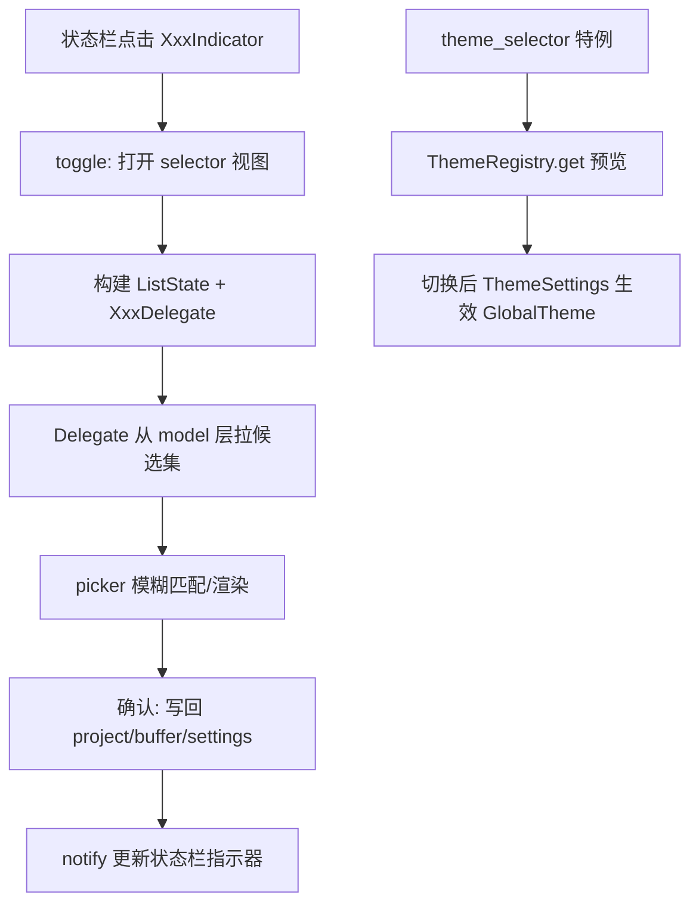

# Selectors and Themes 深度解析（P-P）

> 本页覆盖 **主题系统（theme）** 与 **状态栏选择器家族（*_selector + file_icons）**。它们共同构成"编辑器右下角 + 主题装配"这一层：`theme` 提供主题注册/外观/图标主题的运行时模型，各 `*_selector` 则是把 `theme`/`project` 能力包装成 `picker` 驱动的弹出选择 UI。

## 1. 分层与设计意图

- **theme（模型层）**：不依赖具体窗口后端，负责加载/注册/切换主题与图标主题，并把用户配置（`buffer_line_height`、`ui_density`、`scale`、字体回落链）折算成 GPUI 可用的 `Style`。核心是 [`ThemeRegistry`](file:///e:/Rust/zed/crates/theme/src/registry.rs) 与 [`Theme`](file:///e:/Rust/zed/crates/theme/src/theme.rs)。
- **各 *_selector（视图层）**：几乎同构——`init()` 注册动作 → `toggle()` 打开一个gpui `view` 包裹的 `picker` → `XxxSelector` 持有 `ListState`，`XxxDelegate` 实现 `PickerDelegate` 完成匹配/渲染/确认。它们复用 [Picker 家族](Picker-Family-Deep-Dive) 的骨架。
- **file_icons（资源层）**：解析 Seti 风格图标映射表，供项目面板、各选择器、标题栏复用。

## 2. 类型总览（符号 + 文件:行号）

### 2.1 theme 模型

| 符号 | 位置 | 角色 |
|---|---|---|
| `struct ThemeRegistry` | [registry.rs:67](file:///e:/Rust/zed/crates/theme/src/registry.rs) | 主题/图标主题注册中心（`Global`） |
| `fn default_global` | [registry.rs:81](file:///e:/Rust/zed/crates/theme/src/registry.rs) | 构造带回落主题的全局注册表 |
| `fn get` | [registry.rs:201](file:///e:/Rust/zed/crates/theme/src/registry.rs) | 按名解析 `Arc<Theme>` |
| `fn default_icon_theme` | [registry.rs:211](file:///e:/Rust/zed/crates/theme/src/registry.rs) | 解析默认图标主题 |
| `fn get_icon_theme` | [registry.rs:229](file:///e:/Rust/zed/crates/theme/src/registry.rs) | 按名解析 `Arc<IconTheme>` |
| `struct ThemeMeta` | [registry.rs:17](file:///e:/Rust/zed/crates/theme/src/registry.rs) | 主题元数据（family/name/is_default） |
| `enum Appearance` | [theme.rs:81](file:///e:/Rust/zed/crates/theme/src/theme.rs) | Light/Dark 外观 |
| `enum LoadThemes` | [theme.rs:108](file:///e:/Rust/zed/crates/theme/src/theme.rs) | 主题加载来源（User/Extension…） |
| `struct SystemAppearance` | [theme.rs:159](file:///e:/Rust/zed/crates/theme/src/theme.rs) | 跟随系统外观的 `Global` 包装 |
| `struct ThemeFamily` | [theme.rs:219](file:///e:/Rust/zed/crates/theme/src/theme.rs) | 一套主题（含明/暗变体） |
| `struct Theme` | [theme.rs:235](file:///e:/Rust/zed/crates/theme/src/theme.rs) | 单个主题（样式核心） |
| `struct GlobalTheme` | [theme.rs:320](file:///e:/Rust/zed/crates/theme/src/theme.rs) | 当前生效主题的 `Global` 缓存 |
| `fn default_icon_theme` | [icon_theme.rs:454](file:///e:/Rust/zed/crates/theme/src/icon_theme.rs) | 内置默认图标主题 |
| `fn all_theme_colors` | [styles/colors.rs:596](file:///e:/Rust/zed/crates/theme/src/styles/colors.rs) | 枚举全部主题色（供预览） |

> 支撑文件：`default_colors.rs`（≈70KB 内置调色板）、`fallback_themes.rs`（内置 Zed Dark/Light 回落）、`icon_theme_schema.rs`、`font_family_cache.rs`、`scale.rs`、`ui_density.rs`、`buffer_line_height.rs`，以及 `styles/`（colors/typography/… 把 JSON 主题映射为 GPUI 样式）。

### 2.2 选择器家族（同构模式）

| Crate | 入口/类型 | 位置 |
|---|---|---|
| language_selector | `fn init` / `struct LanguageSelector` / `LanguageSelectorDelegate` | [language_selector.rs:29/33/108](file:///e:/Rust/zed/crates/language_selector/src/language_selector.rs) |
| ↳ 状态栏项 | `struct ActiveBufferLanguage` | [active_buffer_language.rs:13](file:///e:/Rust/zed/crates/language_selector/src/active_buffer_language.rs) |
| encoding_selector | `fn init`/`struct EncodingSelector`/`fn toggle`/`EncodingSelectorDelegate` | [encoding_selector.rs:26/30/45/120](file:///e:/Rust/zed/crates/encoding_selector/src/encoding_selector.rs) |
| ↳ 状态栏项 | `struct ActiveBufferEncoding` | [active_buffer_encoding.rs:16](file:///e:/Rust/zed/crates/encoding_selector/src/active_buffer_encoding.rs) |
| line_ending_selector | `fn init`/`struct LineEndingSelector`/`fn toggle` | [line_ending_selector.rs:21/25/39](file:///e:/Rust/zed/crates/line_ending_selector/src/line_ending_selector.rs) |
| ↳ 状态栏项 | `struct LineEndingIndicator` | [line_ending_indicator.rs:12](file:///e:/Rust/zed/crates/line_ending_selector/src/line_ending_indicator.rs) |
| settings_profile_selector | `fn init`/`struct SettingsProfileSelector`/`new`/`Delegate` | [settings_profile_selector.rs:10/29/50/61](file:///e:/Rust/zed/crates/settings_profile_selector/src/settings_profile_selector.rs) |
| toolchain_selector | `fn init`/`struct ToolchainSelector`/`fn toggle`/`Delegate` | [toolchain_selector.rs:41/45/582/754](file:///e:/Rust/zed/crates/toolchain_selector/src/toolchain_selector.rs) |
| ↳ 状态栏项 | `struct ActiveToolchain` | [active_toolchain.rs:16](file:///e:/Rust/zed/crates/toolchain_selector/src/active_toolchain.rs) |
| theme_selector | `fn init`/`fn toggle_theme_selector`/`fn toggle_icon_theme_selector` | [theme_selector.rs:31/46/64](file:///e:/Rust/zed/crates/theme_selector/src/theme_selector.rs) |
| ↳ 图标主题 | `struct IconThemeSelector`（两个 `new`） | [icon_theme_selector.rs:43/74](file:///e:/Rust/zed/crates/theme_selector/src/icon_theme_selector.rs) |
| file_icons | `struct FileIcons`/`FolderIndicators` | [file_icons.rs:10/16](file:///e:/Rust/zed/crates/file_icons/src/file_icons.rs) |

### 2.3 file_icons 查询方法

`get`（[:22](file:///e:/Rust/zed/crates/file_icons/src/file_icons.rs)）取全局实例；`get_icon`（[:28](file:///e:/Rust/zed/crates/file_icons/src/file_icons.rs)）按路径匹配文件图标；`get_icon_for_type`（[:97](file:///e:/Rust/zed/crates/file_icons/src/file_icons.rs)）按语法类型；`get_folder_icon`（[:110](file:///e:/Rust/zed/crates/file_icons/src/file_icons.rs)）展开/折叠目录图标；`get_chevron_icon`（[:160](file:///e:/Rust/zed/crates/file_icons/src/file_icons.rs)）箭头；`get_folder_indicators`（[:177](file:///e:/Rust/zed/crates/file_icons/src/file_icons.rs)）Git 状态叠加。

## 3. 核心流程

## 4. 集成点

- **`theme_selector` 预览机制**：`toggle_theme_selector`（[:46](file:///e:/Rust/zed/crates/theme_selector/src/theme_selector.rs)）在 `Picker` 高亮时临时改写 `ThemeSettings`，`confirm` 落盘、`dismiss` 撤销——依赖 `ThemeRegistry::get` 与 `all_theme_colors` 做实时预览。
- **状态栏项**：每个 `Active*`（ActiveBufferLanguage/Encoding/Toolchain）都是 `render` 出可点击指示器并 `cx.spawn` 异步拉取当前值，与 [Workspace 深度页](Workspace-Deep-Dive) 的状态栏装配挂钩。
- **`file_icons`**：被 [Project-Panel-and-FS](Project-Panel-and-FS) 与各 selector 共享，图标名来自 `theme` 的 `IconTheme`。

## 5. 相关页

- 概览：[Settings-and-Themes](Settings-and-Themes)、[Misc-Items-and-Selectors](Misc-Items-and-Selectors)
- 深页：[UI-Primitives-Deep-Dive](UI-Primitives-Deep-Dive)、[Picker-Family-Deep-Dive](Picker-Family-Deep-Dive)、[Settings-and-Onboarding-Deep-Dive](Settings-and-Onboarding-Deep-Dive)
