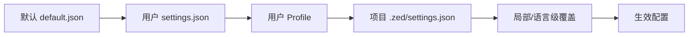
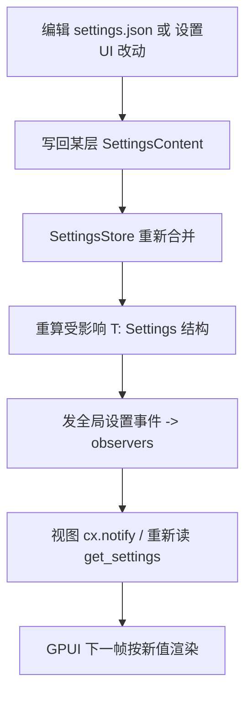

# Settings & Themes（分层配置 / SettingsStore / 主题系统）

Zed 的一切可配置项都走同一套**分层 JSON 合并**引擎（[`settings`](../crates/settings)），外观走**主题系统**（[`theme`](../crates/theme)），编辑界面在 [`settings_ui`](../crates/settings_ui)。核心文件：`settings/src/settings_store.rs`（约 96KB）、`settings/src/settings.rs`、`theme/src/registry.rs`、`theme/src/theme.rs`、`theme/src/styles/`。

## 1. 设置分层与合并

配置从低到高逐层覆盖（后者胜）：

- [`SettingsStore`](../crates/settings/src/settings_store.rs)（L794）持有各层原始 `SettingsContent`（`base_content`、user、project…），合并后按 key 缓存派生出的具体 settings 结构。
- [`SettingsLocation`](../crates/settings/src/settings_store.rs)（L1716）区分 `Global` 与 `Worktree { worktree_id, path }`——因此"同一App 内、不同项目/不同目录"可解析出不同配置（语言服务器、tab 大小等按路径生效）。

## 2. `Settings` trait 与注册

- [`Settings`](../crates/settings/src/settings.rs)（L25）：`'static + Sized + TryFrom<SettingsContent> + Send + Sync`——即"某个设置结构体可从合并后的 JSON 内容构建"。实现者声明自己在 `SettingsContent` 里的 JSON 路径，并提供 UI 绑定用的 `Element`/`Section`。
- 用 `#[derive(RegisterSetting)]`（`settings_macros`，settings.rs L9）在启动时把该类型登记进全局注册表；之后 `SettingsStore::get_settings::<T>(location, cx)` 泛型取值、`observe_settings` 订阅变更。
- 变更通知：任一层文件被外部编辑（`fs` 监视）→ `SettingsStore` 重新解析合并 → 向全局发事件 → 依赖该设置的视图 `cx.notify()` 重绘。`SettingsObserver`（`registry.rs`）承载回调。

## 3. Keymap（键位）

键位是 settings 体系中特殊的一路：`SettingsStore` 把多层 `keymap.json` 合并成 `Keymap`（含 `context` 分层，如 `workspace`/`editor`/`menu`）。`SettingsStoreDelegate::default_context()`（settings.rs L18）提供默认上下文 `KeyContext`；`base_keymap`（如 `"VSCode"`/`"Atom"`/`"Sublime Text"`）先套用一套基键位，再叠加用户自定义。按键分发在 GPUI `Window` 中按当前 focus 的 context 匹配绑定（见 [GPUI-Internals.md](GPUI-Internals.md)）。

## 4. 主题系统（theme crate）

| 类型 | 位置 | 职责 |
|---|---|---|
| [`ThemeRegistry`](../crates/theme/src/registry.rs) | `registry.rs:67` | 加载/查找/切换主题（全局 `Global`） |
| [`Theme`](../crates/theme/src/theme.rs) | `theme.rs:235` | 一套主题：颜色、字号、间距、`appearance()`(L285 明/暗) |
| `ThemeStyles` | `styles/colors.rs:608` | 所有 UI 语义色/样式键（window 背景、边框、状态色…） |
| `IconTheme` | `icon_theme.rs` | 文件/文件夹图标映射 |
| `UiDensity` | `ui_density.rs` | 紧凑/舒适间距 |

- `ThemeRegistry::list()`(L188) 枚举可用主题（含来自扩展贡献的，见 [Extension-System.md](Extension-System.md) 的 `register_theme_proxy`）。
- `default_colors.rs`、`fallback_themes.rs` 提供内置配色与缺省回退；主题本身是 JSON → `ThemeStyles`。
- 视图取色统一走 `cx.theme().styles`，故换主题只需切 `ThemeRegistry` 当前项并全局通知。

## 5. 设置界面（settings_ui）

[`settings_ui`](../crates/settings_ui)（`settings_ui.rs` 约 259KB、`page_data.rs` 约 513KB）把上述注册过的 settings 结构渲染成可视化页面（Editor/Appearance/Keybindings/Extensions/Tool Permissions 等 `pages/`）。每个 `Settings` 类型的 `Element`/`Section` 声明驱动 UI 表单，写回时落到对应 JSON 层。工具权限设置页与 Agent 工具三重门禁相关联（见 [Agent-and-AI.md](Agent-and-AI.md)）。

## 6. 一次改设置如何生效

## 7. 关键符号速查

| 符号 | 位置 | 作用 |
|---|---|---|
| `SettingsStore` | `settings/src/settings_store.rs:794` | 分层合并、缓存、查询、事件 |
| `SettingsLocation` | `settings_store.rs:1716` | Global vs Worktree(按路径) |
| `Settings` trait | `settings/src/settings.rs:25` | 可从 SettingsContent 构建的设置类型 |
| `RegisterSetting`（derive） | `settings/src/settings.rs:9` | 启动时注册设置类型 |
| `Keymap` / `base_keymap` | `settings_store.rs` | 键位合并与基键位 |
| `ThemeRegistry` | `theme/src/registry.rs:67` | 主题加载/切换/枚举 |
| `Theme` / `appearance` | `theme/src/theme.rs:235`/`285` | 单主题与其明暗 |
| `ThemeStyles` | `theme/src/styles/colors.rs:608` | 语义色/样式键集合 |

## 8. 与其他页面的关系
- keymap 事件分发：[GPUI-Internals.md](GPUI-Internals.md)、[GPUI.md](GPUI.md)。
- 主题被所有视图使用：[Workspace-Pane-Dock.md](Workspace-Pane-Dock.md)、[Editor.md](Editor.md)。
- 扩展贡献主题/设置 schema：[Extension-System.md](Extension-System.md)。
- 语言级设置影响 LSP：[Language-and-Project.md](Language-and-Project.md)。
