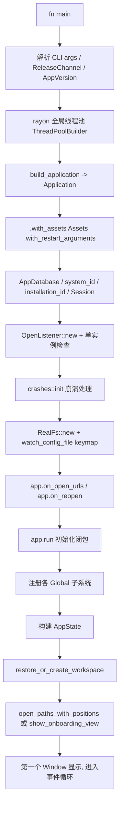

# Startup-Flow（启动函数级调用流程）

本页基于真实源码 [`crates/zed/src/main.rs`](../crates/zed/src/main.rs) 描述 `zed` 从进程启动到出现第一个窗口的完整调用链。

## 1. 总流程图



## 2. 阶段拆解（关键函数）

### 阶段 A：进程与线程准备（`main` 早期，L288–333）
- `args` 解析（`clap::Parser`）；`--system-specs` 分支可提前打印并返回。
- `AppVersion::load(env!("CARGO_PKG_VERSION"), ZED_BUILD_ID, AppCommitSha)`：装配版本信息。
- `rayon::ThreadPoolBuilder::new()....build_global()`：建全局并行池（栈 10MB，线程数 = `available_parallelism/2`）。

### 阶段 B：构建 `Application`（L338–340）
```rust
let app = build_application()
    .with_assets(Assets)
    .with_restart_arguments(restart_arguments);
```
- `build_application()`（L86）内部：`gpui_platform::current_platform(false)` 取得平台后端，再 `Application::new_inaccessible(platform)`（或 `Application::with_platform`，当 `ZED_EXPERIMENTAL_A11Y=1`）。
- 这一步确立了 [GPUI](GPUI.md) 的应用对象 `app`，后续所有初始化都在其回调内进行。

### 阶段 C：身份 / 会话 / 单实例（L342–380）
- `db::AppDatabase::new()`；`app.background_executor().spawn(system_id())`、`spawn(installation_id(...))`、`spawn(Session::new(session_id, ...))`：并发取系统/安装/会话标识。
- `OpenListener::new()` 得到 `(open_listener, open_rx)`：供"已运行实例接收再次 `zed <path>` 打开请求"。
- 单实例检查（分平台）：Linux `listen_for_cli_connections`、Windows `windows_only_instance::handle_single_instance`、macOS `ensure_only_instance()`。

### 阶段 D：崩溃处理 / 文件系统 / keymap 监视（L382–450）
- `crashes::init(InitCrashHandler { .. }, ...)`（按发布渠道决定是否安装）。
- `RealFs::new(app.background_executor())`：文件系统实现。
- `watch_config_file(&executor, fs.clone(), paths::keymap_file())`：热监视 `keymap.json`。
- 非 PTY 启动时后台 `load_login_shell_environment()`：继承登录 shell 环境变量（找 PATH 里的工具）。

### 阶段 E：注册应用级回调（L452–473）
- `app.on_open_urls(...)`：系统"打开 URL/文件"事件 → `open_listener.open(RawOpenRequest { urls, .. })`。
- `app.on_reopen(...)`：macOS dock 重新点击 → `cx.spawn(restore_or_create_workspace(app_state, cx))`。

### 阶段 F：进入 `app.run(初始化闭包)`（L475 起）
`app.run` **启动平台事件循环**，并在其闭包内完成全局装配（此时 `cx: &mut App`）。已确认真实调用序列（L476–520）：

```rust
app.run(move |cx| {
    cx.set_global(app_db);
    trusted_worktrees::init(db_trusted_paths, cx);
    menu::init();
    zed_actions::init();
    release_channel::init(app_version, cx);
    gpui_tokio::init(cx);
    settings::init(cx);
    zlog_settings::init(cx);
    zed::watch_settings_files(fs.clone(), cx);
    handle_keymap_file_changes(user_keymap_file_rx, user_keymap_watcher, cx);
    // 构造 ReqwestClient 并设为全局 HTTP client
    cx.set_http_client(Arc::new(http));
    <dyn Fs>::set_global(fs.clone(), cx);
    OpenListener::set_global(cx, open_listener.clone());
    extension::init(cx);
    // ... 继续注册 client / UserStore / LanguageRegistry / Theme / AppState 等
});
```

要点：
- `settings::init` + `watch_settings_files` + `handle_keymap_file_changes`：设置与键位的热更新链路就绪。
- `cx.set_http_client` / `<dyn Fs>::set_global`：把 HTTP、文件系统以 trait-object 形式注入全局，供其余 crate 通过 `Fs::global(cx)` 等取用。
- 随后构建 `AppState`（聚合 `fs`、`http`、`client`、`languages`、`prompt_builder` 等），`WorkspaceStore`，并注册 `initialize_workspace`（由 `crate::zed` 导出）里各面板/动作。

### 阶段 G：打开/恢复首个窗口（闭包尾部 + `open_rx` 消费）
- `restore_or_create_workspace(app_state, cx)`：尝试恢复上次会话，否则新建空项目窗口。
- `open_paths_with_positions(...)`：按 CLI/系统传入的路径打开。
- 首次运行：`show_onboarding_view(...)`（`onboarding::FIRST_OPEN`）。
- 消费 `open_rx`：把后续 `zed <file>` 转发到已运行实例。
- `build_window_options(...)` 与 `app_menus(...)`：窗口尺寸/标题栏与菜单装配（`crate::zed` 提供）。

## 3. 关键函数速查

| 函数 | 位置 | 作用 |
|---|---|---|
| `build_application()` | `main.rs:86` | 选择平台后端并创建 `Application` |
| `AppVersion::load(..)` | `main.rs:304` | 版本 / commit / 渠道 |
| `crashes::init(InitCrashHandler{..})` | `main.rs:387` | 崩溃上报 |
| `RealFs::new(..)` | `main.rs:432` | 文件系统 |
| `watch_config_file(..)` | `main.rs:433` | 监视 keymap/settings 文件 |
| `app.on_open_urls(..)` | `main.rs:452` | 系统打开事件 |
| `app.run(closure)` | `main.rs:475` | 进入事件循环 + 全局装配 |
| `restore_or_create_workspace(..)` | `main.rs:466`(调用) | 恢复/新建工作区 |
| `initialize_workspace(..)` | `crates/zed/src/zed.rs` | 注册面板、动作、deferred 项 |

> 注：`main.rs` L520 之后为更多 `::init`/`set_global` 与 `AppState` 组装的延续，模式与上表一致——即"在 `app.run` 闭包内把所有子系统注册为 Global，再驱动打开首个 workspace"。
