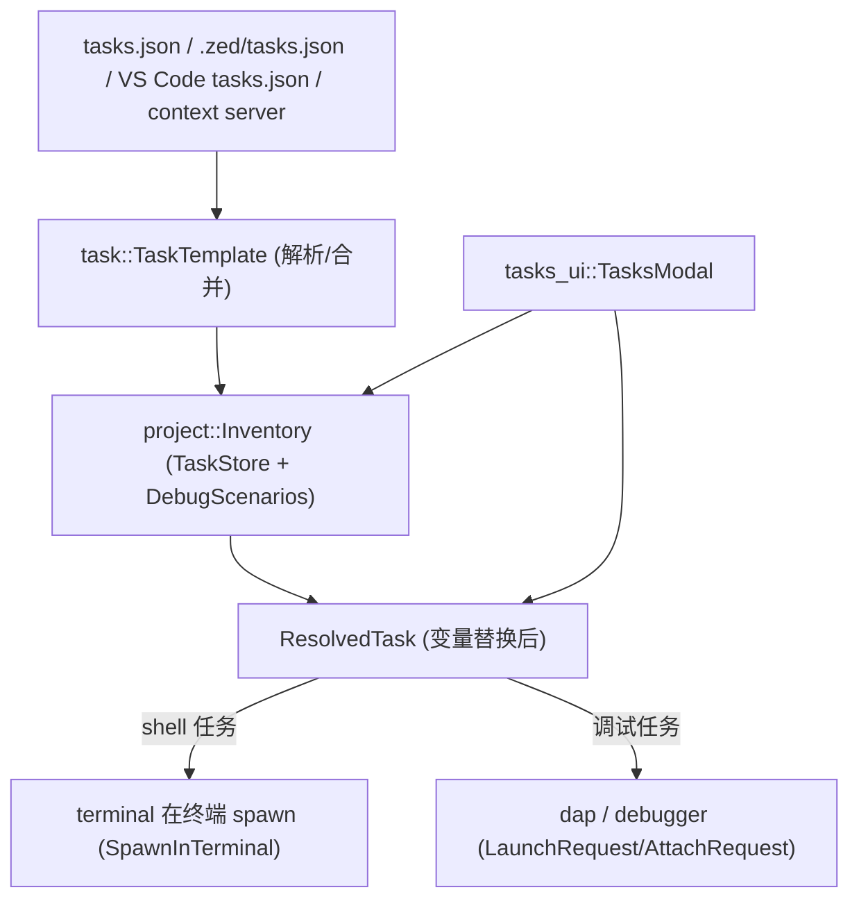
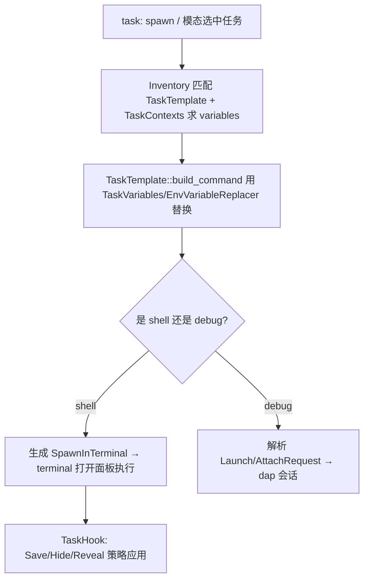

# 任务系统深挖（Task 模板 · 解析变量 · Inventory · 终端/DAP 分发）

> 返回 [Home](Home) · [Module-Index](Module-Index)
>
> 概览见 [Tasks-and-Tooling.md](Tasks-and-Tooling.md)。本页是**函数/类型级参考手册**，覆盖任务（Task / 运行 / 调试启动）全栈：`task`（数据模型 + 模板 + VS Code 兼容格式）· `project/task_inventory.rs` + `task_store.rs`（收集/存储/解析）· `tasks_ui`（模态/生成 UI）。调试场景与任务共用同一 `Inventory`。所有符号均来自 `grep`/`read` 确证（`文件:行号`）。

## 1. 分层总览

## 2. 数据模型（`crates/task/src/task.rs` 20KB）

| 类型 | 位置 | 角色 |
| --- | --- | --- |
| `struct TaskId` | task.rs:38 | 任务唯一 id（`String`） |
| `struct SpawnInTerminal` | task.rs:42 | **终端任务负载**：label/command/args/cwd/env/cwd/task_id 等，交给 `terminal` 执行 |
| `struct ResolvedTask` | task.rs:114 | 变量替换后的可执行任务（`template` + `resolved`） |
| `enum VariableName` | task.rs:154 | 内置变量：`File`/`DirWithTrailingSlash`/`WorktreeRelativePath`/`StarterBundle`/`SelectedText`/`Symbol`/`ServerName`/`Adapter`/`Project`… |
| `struct TaskVariables` | task.rs:290 | `HashMap<VariableName,String>` 变量表（`capture`/`insert`/`extend`） |
| `struct TaskContext` / `SharedTaskContext` | task.rs:341 / 354 | 一次任务的上下文（variables + cwd + tags） |
| `struct RunnableTag` | task.rs:372 | 语言服务器可运行标签（来自 LSP `experimental`，如 cargo/shell） |
| `EnvVariableReplacer` | task.rs:407 | 展开 `$VAR`/`${VAR}` 环境/任务变量 |

## 3. 模板与来源（`crates/task/src/task_template.rs` 45KB）

| 类型 | 位置 | 角色 |
| --- | --- | --- |
| `struct TaskTemplate` | task_template.rs:24 | 任务声明模板（label/command/args/env/cwd/tags…，`build_command` 做变量替换） |
| `struct TaskTemplates` | task_template.rs:141 | `Vec<TaskTemplate>` 新类型（`tasks.json` 顶层） |
| `enum TaskHook` | task_template.rs:95 | 前置钩子（`Save`/`Hide`/`Notify`） |
| `enum RevealStrategy` / `HideStrategy` / `SaveStrategy` | task_template.rs:103 / 116 / 129 | 终端显示/隐藏/保存策略 |
| `enum DebugArgsRequest` | task_template.rs:85 | 调试参数解析请求 |
| `static_source.rs` | 4.6KB | Zed 内置静态任务（按语言：rust/cargo、node、python…） |

## 4. VS Code 兼容（`vscode_format.rs` 21KB · `vscode_debug_format.rs` · `debug_format.rs`）

| 类型 | 位置 | 角色 |
| --- | --- | --- |
| `struct VsCodeTaskFile` / `VsCodeTaskDefinition` / `enum Command` | vscode_format.rs:142 / 17 / 59 | 解析 VS Code `tasks.json` 并转成 `TaskTemplate`（`TaskOptions` 10） |
| `struct VsCodeDebugTaskFile` / `VsCodeDebugTaskDefinition` | vscode_debug_format.rs:51 / 12 | VS Code `launch.json` 兼容 |
| `struct LaunchRequest` / `AttachRequest` / `TcpArgumentsTemplate` | debug_format.rs:86 / 56 / 15 | DAP 启动/附加请求模板 |
| `adapter_schema.rs` | 0.6KB | DAP adapter 声明 schema |

## 5. 收集与存储（`crates/project/src/`）

**`task_inventory.rs`(1262 行)** —— 任务与调试场景统一清单：

| 类型 | 位置 | 角色 |
| --- | --- | --- |
| `struct Inventory` | task_inventory.rs:43 | 聚合任务 + `DebugScenario`；`trait InventoryContents`(62)/`struct InventoryFor<T>`(79) 泛型化两类条目 |
| `enum TaskSourceKind` | task_inventory.rs:147 | 来源：`User`/`Worktree`/`File`/`vscode`/`ContextServer` + `Template{source}` |
| `struct TaskContexts` / `BasicContextProvider` / `ContextProviderWithTasks` | task_inventory.rs:173 / 1004 / 1133 | 按 buffer 计算任务变量（光标/符号/路径）的上下文提供者 |
| `struct DebugScenarioContext` | task_inventory.rs:36 | 调试场景上下文（复用同一 Inventory） |

**`task_store.rs`(504 行)** —— 模板存储后端：

| 类型 | 位置 | 角色 |
| --- | --- | --- |
| `enum TaskStore` | task_store.rs:26 | `Custom(FileBasedTemplateStore)` / `TaskTemplateStore`（用户 vs 项目 tasks.json） |
| `struct StoreState` / `enum StoreMode` | task_store.rs:31 / 40 | 已解析模板 + 原始 JSON 缓冲状态 |

## 6. UI 与执行（`crates/tasks_ui/src/`）

`tasks_ui.rs`(27KB)：`init`(101) 注册动作 → `spawn_task_or_modal`(185)（有任务直接跑、否则开模态）→ `toggle_modal`(230)/`spawn_tasks_filtered`(268)/`task_contexts`(358)/`worktree_context`(465)/`insert_task_json_into_editor`(22)。

`modal.rs`(52KB)：`struct TasksModal`(125) + `TasksModalDelegate`(26)（实现 `PickerDelegate`，复用 [Picker-Family-Deep-Dive](Picker-Family-Deep-Dive.md)）、`struct TaskOverrides`(42)、`ShowAttachModal`(218)。

## 7. 一次任务从按键到执行的流程

## 8. 集成 / 相关页

- 执行侧：`terminal`（`alacritty` 终端）见 [Terminal-Deep-Dive.md](Terminal-Deep-Dive.md)；`dap`/`debugger` 见 [Debugger-Deep-Dive.md](Debugger-Deep-Dive.md)。
- 变量来源：`language`/`LSP`（`RunnableTag`、符号）见 [LSP-Features.md](LSP-Features.md)；`context server` 任务见 [Extension-Deep-Dive.md](Extension-Deep-Dive.md)。
- 模态选择器：[Picker-Family-Deep-Dive.md](Picker-Family-Deep-Dive.md)、[Project-Deep-Dive.md](Project-Deep-Dive.md)。
- 概览：[Tasks-and-Tooling.md](Tasks-and-Tooling.md)
- 导航：[Home](Home) · [Module-Index](Module-Index)
