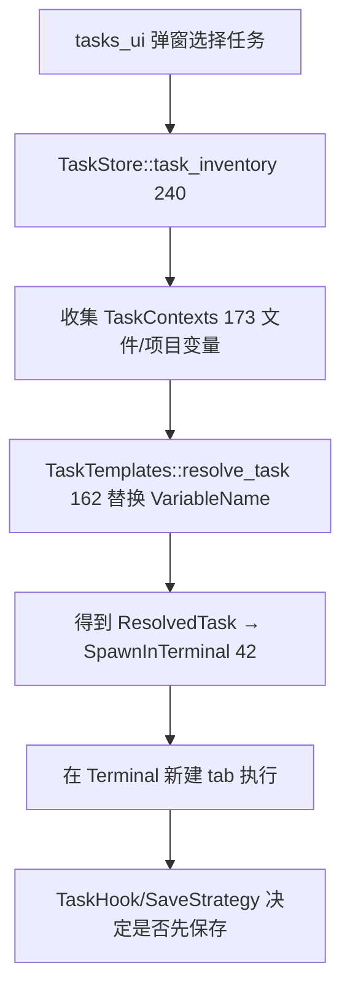

# Tasks & Tooling（任务运行 / REPL / 日志 / 性能剖析）

本页收录四个"工具型"子系统：**外部任务运行**（[`task`](../crates/task) + `project::TaskStore` + [`tasks_ui`](../crates/tasks_ui)）、**REPL / 内核**（[`repl`](../crates/repl)）、**日记**（[`journal`](../crates/journal)）、**性能剖析器**（[`miniprofiler_ui`](../crates/miniprofiler_ui)）。

## 1. Tasks（在终端里跑构建/脚本）

任务模板写在 `tasks.json`（或 VSCode 兼容的 `.vscode/tasks.json`），运行时替换变量、拼成命令行丢进终端。

| 类型 | 位置 | 职责 |
|---|---|---|
| `TaskTemplate` | [`task_template.rs:24`](../crates/task/src/task_template.rs) | 任务定义（label/command/args/env/tag…） |
| `TaskTemplates` | [`task_template.rs:141`](../crates/task/src/task_template.rs) | 模板集合；`resolve_task`(L162) |
| `ResolvedTask` | [`task.rs:114`](../crates/task/src/task.rs) | 变量替换后的具体任务 |
| `SpawnInTerminal` | [`task.rs:42`](../crates/task/src/task.rs) | 交给终端执行的最终命令 |
| `TaskVariables`/`VariableName` | [`task.rs:290/154`](../crates/task/src/task.rs) | `${file}`、`${workspace_folder}` 等 |
| `TaskHook`/`SaveStrategy` | [`task_template.rs:95/129`](../crates/task/src/task_template.rs) | 运行前钩子、是否先保存 |
| `enum TaskStore` | [`task_store.rs:26`](../crates/project/src/task_store.rs) | Project 侧任务存储（Local/Remote） |
| `Inventory` | [`task_inventory.rs:43`](../crates/project/src/task_inventory.rs) | 当前可用任务清单 |
| `VsCodeTaskFile` | [`vscode_format.rs:142`](../crates/task/src/vscode_format.rs) | 导入 VSCode 任务 |

`TaskStore`（Local/Remote 两态，`local` L162 / `remote` L183）把模板按 `TaskSource`（用户/项目/扩展）聚合，`task_context_for_location`（L205）解析出当前文件/工作目录来填变量；协作时 `shared`/`unshared`（L247/259）同步任务清单。`RevealStrategy`/`HideStrategy`（L103/116）控制任务面板何时显隐。

## 2. REPL / 内核（交互式代码执行）

[`repl`](../crates/repl) 提供 Jupyter 式"选中代码→发送到内核→就地显示结果"。

| 类型 | 位置 | 职责 |
|---|---|---|
| `ReplStore` | [`repl_store.rs:27`](../crates/repl/src/repl_store.rs) | 各 buffer 关联的运行时会话 |
| `KernelSpecification` | [`kernels/mod.rs:246`](../crates/repl/src/kernels/mod.rs) | 一个可用内核（Python/R…）的定义 |
| `KernelStatus` | [`kernels/mod.rs:678`](../crates/repl/src/kernels/mod.rs) | 未启动/启动中/就绪/忙碌 |
| `ReplSessionsPage` | [`repl_sessions_ui.rs:173`](../crates/repl/src/repl_sessions_ui.rs) | 会话管理页（列出运行中内核） |
| `ReplSettings` | [`repl_settings.rs:5`](../crates/repl/src/repl_settings.rs) | 相关设置 |

内核通过 Jupyter **Messaging（ZMQ）** 协议与语言运行时通信（`kernels/` 目录封装）。选代码 → 找/启 `ReplStore` 里对应 buffer 的内核 → `execute_request` → 流式收回 `stdout`/`display_data` 作为 Editor 内联 block。

## 3. Journal（每日/每周日志）

[`journal`](../crates/journal) 提供一键打开"今天/本周"笔记文件：`new_journal_entry`（[journal.rs:57](../crates/journal/src/journal.rs)）按 `JournalSettings`（L24：路径模板、周期 daily/weekly、扩展名）在指定目录创建/打开对应 `.md`，并作为普通 `Editor` Item 呈现（因此天然支持 Markdown 预览，见 [Markdown-and-Preview.md](Markdown-and-Preview.md)）。`init`（L46）注册 Action。

## 4. Miniprofiler（内置性能剖析）

[`miniprofiler_ui`](../crates/miniprofiler_ui) 的 `ProfilerWindow`（[miniprofiler_ui.rs:186](../crates/miniprofiler_ui/src/miniprofiler_ui.rs)）是 GPUI 自绘的时间线火焰图窗口，数据来自 GPUI 内核的 `profiler`（帧 journal、布局/绘制耗时，见 [GPUI-Internals.md](GPUI-Internals.md)）。开发者在调试构建里触发后，可逐帧查看 request_layout/prepaint/paint 与 task 排布，定位掉帧。

## 5. 关键符号速查

| 符号 | 位置 | 作用 |
|---|---|---|
| `TaskTemplate` | `task/src/task_template.rs:24` | 任务模板 |
| `TaskTemplates::resolve_task` | `task_template.rs:162` | 解析为具体任务 |
| `ResolvedTask` / `SpawnInTerminal` | `task/src/task.rs:114/42` | 已解析任务 / 终端命令 |
| `TaskVariables` | `task.rs:290` | 变量表 |
| `enum TaskStore` | `project/src/task_store.rs:26` | 任务存储（Local/Remote） |
| `Inventory` / `TaskContexts` | `project/src/task_inventory.rs:43/173` | 任务清单 / 上下文 |
| `VsCodeTaskFile` | `task/src/vscode_format.rs:142` | 导入 VSCode 任务 |
| `ReplStore` | `repl/src/repl_store.rs:27` | REPL 会话存储 |
| `KernelSpecification` / `KernelStatus` | `repl/src/kernels/mod.rs:246/678` | 内核定义 / 状态 |
| `new_journal_entry` | `journal/src/journal.rs:57` | 打开当日笔记 |
| `ProfilerWindow` | `miniprofiler_ui/src/miniprofiler_ui.rs:186` | 性能时间线窗口 |

## 6. 与其他页面的关系
- 任务在终端 tab 执行：[Terminal.md](Terminal.md)。
- 调试任务与 launch/attach 配置同源：[Debugger.md](Debugger.md)。
- REPL 结果内联 block 依赖编辑器：[Editing-Deep-Dive.md](Editing-Deep-Dive.md)。
- 任务选择弹窗是一个 Picker：[Picker-and-Commands.md](Picker-and-Commands.md)。
- 剖析器基于 GPUI profiler：[GPUI-Internals.md](GPUI-Internals.md)。
