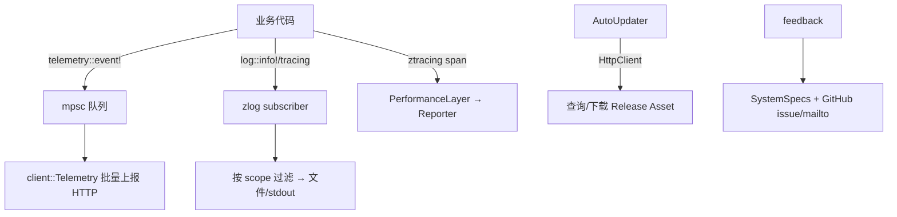

# Telemetry, Logging & Updates（遥测 / 日志 / 追踪 / 自动更新 / 反馈）

覆盖诊断与运维类模块：[`telemetry`](../crates/telemetry) + [`telemetry_events`](../crates/telemetry_events)、[`zlog`](../crates/zlog) + `zlog_settings`、[`ztracing`](../crates/ztracing) + `ztracing_macro`、[`auto_update`](../crates/auto_update)(+helper/ui)、[`feedback`](../crates/feedback)、[`release_channel`](../crates/release_channel)、[`system_specs`](../crates/system_specs)、[`crashes`](../crates/crashes)、[`etw_tracing`](../crates/etw_tracing)。

## 1. 总览

## 2. telemetry：事件上报
[`telemetry.rs`](../crates/telemetry/src/telemetry.rs)

| 符号 | 位置 | 作用 |
|---|---|---|
| `macro event!` | [L22](../crates/telemetry/src/telemetry.rs) | `telemetry::event!("Keymap Changed", version=..)` 构造并入队 |
| `Event = telemetry_events::FlexibleEvent` | [L5](../crates/telemetry/src/telemetry.rs) | `{ event_type, event_properties: HashMap }` |
| `send_event` | [L56](../crates/telemetry/src/telemetry.rs) | 投递到 `TELEMETRY_QUEUE`（`OnceLock`） |
| `init(tx)` | [L62](../crates/telemetry/src/telemetry.rs) | 启动时注入发送端 |

约定事件名 "Noun Verbed"；`event_properties` 走 `serde_json`。真正的批量上传、去重、`current_platform` 等在 `client` 的 `Telemetry`（[Collaboration-and-Call.md](Collaboration-and-Call.md)）。`telemetry_events` crate 定义各结构化事件类型。调试：`RUST_LOG=telemetry=trace`。

## 3. zlog：统一日志
[`crates/zlog/src`](../crates/zlog/src) —— 自建轻量 `log::Log` 实现（非 env_logger）。

| 符号 | 位置 | 作用 |
|---|---|---|
| `zlog::init` / `try_init` | [`zlog.rs:12`](../crates/zlog/src/zlog.rs) / [L19](../crates/zlog/src/zlog.rs) | 安装全局 logger |
| `process_env` | [L46](../crates/zlog/src/zlog.rs) | 解析 `RUST_LOG` |
| `struct EnvFilter` / `parse` | [`env_config.rs:3`](../crates/zlog/src/env_config.rs) / [L9](../crates/zlog/src/env_config.rs) | 目标级过滤 |
| `init_env_filter` / `is_scope_enabled` | [`filter.rs:49`](../crates/zlog/src/filter.rs) / [L62](../crates/zlog/src/filter.rs) | 运行时按 scope 判定 |
| `refresh_from_settings` | [L93](../crates/zlog/src/filter.rs) | 从设置热更新日志级别 |
| `sink::Record` / `submit` / `flush` | [`sink.rs:37`](../crates/zlog/src/sink.rs) / [L116](../crates/zlog/src/sink.rs) / [L206](../crates/zlog/src/sink.rs) | 异步写出（stdout/stderr/file） |
| `Timer::warn_if_gt` / `end` | [L348](../crates/zlog/src/zlog.rs) / [L353](../crates/zlog/src/zlog.rs) | 慢操作计时告警 |

`zlog_settings` 把日志级别接入分层设置（[Settings-and-Themes.md](Settings-and-Themes.md)）。

## 4. ztracing：性能追踪
[`ztracing/src/lib.rs`](../crates/ztracing/src/lib.rs)：`Span`(L43，`current`/`enter`/`record` L47-53)、`init`(L57/L101)。web 侧 `PerformanceLayer`+`PerformanceReporter`(web.rs:37/42)、`performance_layer()`(L85)、`dropped_event_count`(L101)——基于 tracing layer 收集性能事件并回报。`ztracing_macro` 提供 `#[trace]` 类属性宏。Windows 的 ETW 接入见 `etw_tracing`。

## 5. auto_update：自动更新
[`auto_update.rs`](../crates/auto_update/src/auto_update.rs)

| 符号 | 位置 | 作用 |
|---|---|---|
| `struct AutoUpdater` | [L176](../crates/auto_update/src/auto_update.rs) | 全局更新状态机（`Entity`） |
| `AutoUpdater::check` | [L305](../crates/auto_update/src/auto_update.rs) | 手动/定时检查更新 Action |
| `update_check_type` | [L510](../crates/auto_update/src/auto_update.rs) | 启动/定时/手动 |
| `struct AssetQuery` / `ReleaseAsset` | [L113](../crates/auto_update/src/auto_update.rs) / [L188](../crates/auto_update/src/auto_update.rs) | 版本渠道资源查询 |

流程：按 `release_channel` + 平台拼 `AssetQuery` → 经 [HttpClient](Network-And-HTTP.md) 查询 → 下载 → 通过 `auto_update_helper`（独立进程，规避"更新自身"文件锁）替换 → `auto_update_ui` 提示重启。渠道由 `release_channel`（stable/preview/dev，含版本号与 URL）决定。

## 6. feedback + system_specs：反馈诊断
[`feedback.rs`](../crates/feedback/src/feedback.rs)：`init`(L48) 注册 actions —— `OpenZedRepo`/`CopyInstalledExtensionsIntoClipboard`(L13/15) 及 `FileBugReport`/`RequestFeature`/`EmailZed`（`zed_actions::feedback`）。`file_bug_report_url`(L23)/`email_zed_url`(L36) 把 `SystemSpecs`（[system_specs](../crates/system_specs) crate，采集 OS/内存/CPU/发行版）编码进 GitHub issue 模板或 mailto。`CopySystemSpecsIntoClipboard` 一键复制诊断。

## 7. crashes：崩溃报告
[`crashes`](../crates/crashes) 负责安装崩溃钩子、收集 backtrace 并（在用户同意下）上传；与 telemetry/sentry 风格的错误通道配合。

## 8. 与其他页面的关系
- HTTP 上报底座：[Network-And-HTTP.md](Network-And-HTTP.md)。
- `client::Telemetry` 上传实现：[Collaboration-and-Call.md](Collaboration-and-Call.md)。
- 日志/更新设置项：[Settings-and-Themes.md](Settings-and-Themes.md)。
- 构建渠道差异：[Building-on-Windows.md](Building-on-Windows.md)。
