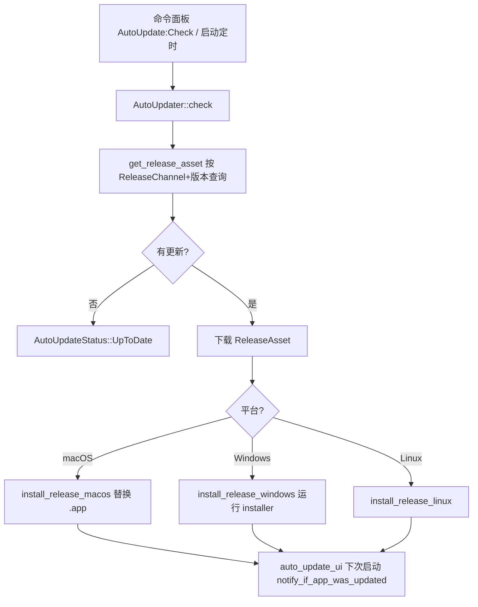

# Telemetry & 自动更新 深入解析（Deep Dive）

> 本页覆盖 Zed 的"遥测 + 崩溃上报 + 发布通道 + 自动更新"闭环：`telemetry`（事件发送门）、`telemetry_events`（事件 schema）、`crashes`（Sentry 崩溃钩子）、`release_channel`（Dev/Nightly/Preview/Stable 通道）、`auto_update`（跨平台更新引擎）、`auto_update_ui`（更新提示/发布说明/公告）、`feedback`（一键反馈/报障）。共 7 个 crate。

## 1. 分层设计

这条链路把"应用运行状态 → 上报/更新决策 → 落地"拆成清晰层次：

- **事件 schema 层** `telemetry_events`：纯数据定义 crate，声明 `Event`（大枚举）与请求体 `EventRequestBody`/`EventWrapper`，无逻辑，供多方共享。
- **事件门层** `telemetry`：`init(tx)` 保存一个 `mpsc::UnboundedSender<Event>` 到 `TELEMETRY_QUEUE`（`OnceLock`），`send_event(event)` 把事件塞进队列——业务代码只依赖这个极薄门面，实际网络发送由 `client`/`zed` 后台任务批量上传。
- **崩溃层** `crashes`：基于 `crash_handler` 附加原生崩溃处理器，落地为 Sentry（`SENTRY_USER_ID`），携带 `CrashInfo`/`InitCrashHandler`。
- **通道层** `release_channel`：编译期确定当前 `RELEASE_CHANNEL`，提供版本号、更新检查端点、显示名。
- **更新引擎层** `auto_update`：`AutoUpdater`（GPUI Entity）负责查询发布资产、下载、按平台安装（macOS/Windows/Linux 各一条路径）。
- **更新 UI 层** `auto_update_ui`：把 `AutoUpdater` 状态渲染成 toast / 发布说明 / 公告，启动后提示"已更新"。
- **反馈层** `feedback`：把 `SystemSpecs`+已装扩展拼成 GitHub issue URL 或 `mailto:`。

## 2. 类型总览

| 符号 | 文件:行 | 角色 |
| --- | --- | --- |
| `fn send_event(event: Event)` | telemetry.rs:56 | 事件入队门 |
| `fn init(tx)` | telemetry.rs:62 | 保存 sender 到 `TELEMETRY_QUEUE`(:66) |
| `pub use FlexibleEvent as Event` | telemetry.rs:5 | 门面重导出的事件类型 |
| `struct EventRequestBody` | telemetry_events.rs:8 | 批量上传的请求体 |
| `struct EventWrapper` | telemetry_events.rs:37 | 单事件封装（时间戳/实时标志） |
| `enum Event` | telemetry_events.rs:94 | 所有事件变体总枚举 |
| `struct FlexibleEvent` | telemetry_events.rs:99 | 松类型事件（`telemetry!` 宏构造） |
| `struct AssistantEventData` | telemetry_events.rs:111 | Assistant 用量明细 |
| `fn init<F,S,C,P>(crash_init,..)` | crashes.rs:48 | 安装崩溃 + panic 钩子 |
| `struct CrashServer` | crashes.rs:180 | 崩溃服务状态（Sentry 客户端） |
| `struct CrashInfo` | crashes.rs:192 | 崩溃上下文（init + 最近事件） |
| `struct InitCrashHandler` | crashes.rs:221 | 初始化参数（metrics id 等） |
| `const SENTRY_USER_ID` | crashes.rs:237 | Sentry 用户标签键 |
| `static RELEASE_CHANNEL` | lib.rs:37 | 当前发布通道（`LazyLock`） |
| `static RELEASE_CHANNEL_NAME` | lib.rs:13 | 通道名（构建期注入） |
| `enum ReleaseChannel` | lib.rs:139 | Dev/Nightly/Preview/Stable |
| `fn display_name()` | lib.rs:206 | 通道显示名 |
| `fn from_str(channel)` | lib.rs:272 | 字符串→通道解析 |
| `fn app_identifier()` | lib.rs:45 | 每通道 bundle id |
| `struct AutoUpdater` | auto_update.rs:176 | GPUI Entity，更新引擎 |
| `enum AutoUpdateStatus` | auto_update.rs:123 | Idle/Checking/Updating/UpToDate/Downloading |
| `struct AssetQuery` | auto_update.rs:113 | 查询发布资产的参数 |
| `struct ReleaseAsset` | auto_update.rs:188 | 单个下载资产 |
| `struct GlobalAutoUpdate` | auto_update.rs:258 | `Option<Entity<AutoUpdater>>` global |
| `fn check(_: &Check,..)` | auto_update.rs:305 | Action 触发的检查入口 |
| `async fn get_release_asset(..)` | auto_update.rs:670 | 拉取最新 release 资产 |
| `async fn install_release(..)` | auto_update.rs:924 | 安装总调度 |
| `async fn install_release_linux(..)` | auto_update.rs:1118 | Linux 落地 |
| `async fn install_release_macos(..)` | auto_update.rs:1186 | macOS 替换 .app |
| `async fn install_release_windows(..)` | auto_update.rs:1302 | Windows 运行安装器 |
| `fn init(cx)` | auto_update_ui.rs:38 | 注册更新相关 Action/订阅 |
| `fn notify_if_app_was_updated(cx)` | auto_update_ui.rs:372 | 启动后"已更新"提示 |
| `struct UpdateNotification` | auto_update_ui.rs:328 | 更新 toast |
| `struct AnnouncementContent` | auto_update_ui.rs:191 | 公告内容 |
| `fn init(cx)` | feedback.rs:48 | 注册反馈/报障 Action |
| `fn file_bug_report_url(specs)` | feedback.rs:23 | 生成 GitHub issue URL |
| `fn email_zed_url(specs)` | feedback.rs:36 | 生成 mailto 反馈 |

## 3. 核心方法与调用锚点

**`telemetry`（telemetry.rs）—— 极薄事件门**
- `init(tx: mpsc::UnboundedSender<Event>)`(:62) 把 sender 存入 `static TELEMETRY_QUEUE: OnceLock<..>`(:66)。
- `send_event(event)`(:56) 取出队列 `send`；`telemetry!` 宏（:24/:31）构造 `Event{event_type, payload}`。业务侧从不直接联网。

**`auto_update::AutoUpdater`（auto_update.rs）**
- `check(_: &Check, window, cx)`(:305)：命令面板 Action 入口。
- `get_release_asset(..)`(:670)：按 `AssetQuery`(:113，含 `ReleaseChannel`、版本号) 查询 Zed 发布服务返回 `ReleaseAsset`(:188)。
- `install_release(..)`(:924) → 平台分发：`install_release_macos`(:1186)/`install_release_windows`(:1302)/`install_release_linux`(:1118)。Windows 路径返回 `Result<Option<PathBuf>>`（下载的 installer 路径），配合 `auto_update_helper`。
- 状态用 `AutoUpdateStatus`(:123) 表达，`impl PartialEq`(:143) 自定义比较；`GlobalAutoUpdate`(:258) 经 `cx.default_global::<GlobalAutoUpdate>()`(:424/:601/:657) 取用。

**`release_channel`（lib.rs）**
- `RELEASE_CHANNEL_NAME`(:13) 由 `build.rs` 注入；`RELEASE_CHANNEL`(:37) 用 `from_str`(:272) 惰性解析。
- `display_name()`(:206)、`app_identifier()`(:45，每通道独立 bundle id 以并存安装)。

**`auto_update_ui`（auto_update_ui.rs）**
- `init(cx)`(:38) 订阅 `AutoUpdater` 事件。
- `notify_if_app_was_updated(cx)`(:372)：会话启动比较版本，弹 `UpdateNotification`(:328)；`AnnouncementContent`(:191)/`SkillsAnnouncement`(:203) 渲染运营公告。

**`crashes`（crashes.rs）**
- `init(crash_init,..)`(:48) 通过 `CrashHandler::attach`(:105) 捕获原生崩溃，转成 Sentry。`force_backtrace()`(:31) 主动打印栈。

## 4. 更新检查与安装流程

## 5. 遥测数据流

`telemetry!` 宏在业务代码各处生成 `Event` → `send_event()` 推入 `TELEMETRY_QUEUE`（无阻塞、无网络）→ 后台消费者批量攒成 `EventRequestBody`（含 `EventWrapper` 逐项时间戳）→ 由 `client` 通过 `http_client` 上传到 Zed 指标端点。`release_channel` 与 `session`（见 Network-HTTP 页）为每条事件提供通道与 session id；`crashes` 用 `SENTRY_USER_ID` 把崩溃与 metrics id 关联。是否上报由用户在 `settings` 的 telemetry 开关控制（关则 `init` 不安装真实 sender）。

## 6. 集成点

- `zed` 主 crate 启动时依次 `crashes::init` → `telemetry::init` → `auto_update` 注册 global → `auto_update_ui::init` → `feedback::init`。
- `auto_update`/`auto_update_ui` 依赖 `release_channel` 决定检查哪个通道、`client`/`http_client` 拉取资产。
- 几乎每个 UI crate 都 `use telemetry::{telemetry, Event}` 打点，事件 schema 集中在 `telemetry_events`。
- `update_to_latest`、`zed:check_for_updates` 等 Action 定义在 `zed_actions`，由 `auto_update`/`auto_update_ui` 实现。

## 7. 相关页

- [Telemetry-Logging-Updates](Telemetry-Logging-Updates.md)（本族概览）
- [Network-HTTP-Deep-Dive](Network-HTTP-Deep-Dive.md)（`session`/`http_client` 上传通道）
- [Extension-Host-Deep-Dive](Extension-Host-Deep-Dive.md)（扩展更新与 `ReleaseChannel`）
- [Startup-Flow](Startup-Flow.md)（各 init 的启动顺序）
