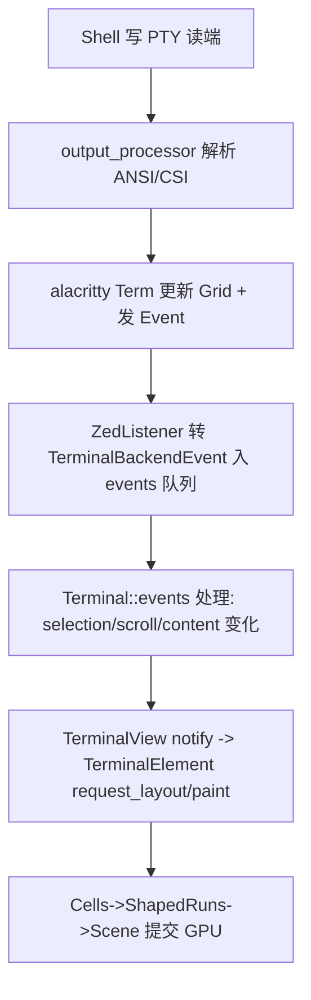

# Deep Reference: terminal & terminal_view

> 参考手册级：`crates/terminal`（PTY + Alacritty 终端仿真内核，`terminal.rs` 217KB）与 `crates/terminal_view`（GPUI 视图/面板/元素，`terminal_panel.rs` 127KB + `terminal_view.rs` 119KB + `terminal_element.rs` 113KB）。分层：**PTY 字节流 → alacritty_terminal 解析成网格 → Zed `Terminal` 状态 → `TerminalElement` GPU 绘制**。

## 1. `crates/terminal` 类型总览
### 主模型 [`terminal.rs`](../crates/terminal/src/terminal.rs)
| 类型 | 位置 | 角色 |
|---|---|---|
| `struct Terminal` | [L1501](../crates/terminal/src/terminal.rs) | **核心状态**（见下） |
| `struct TerminalBuilder` | [L971](../crates/terminal/src/terminal.rs) | 配置并 `build()` 出一个 `Terminal`（size/options/reader/writer/event_tx） |
| `enum TerminalType` | [L1486](../crates/terminal/src/terminal.rs) | `Pty { resources, info }`｜`DisplayOnly` |
| `struct TerminalBounds` | [L765](../crates/terminal/src/terminal.rs) | 单元格尺寸（impl `alacritty_terminal::term::Dimensions`） |
| `struct TerminalError` | [L833](../crates/terminal/src/terminal.rs) | 构建/PTY 错误 |
| `struct TerminalMode` / `enum TerminalModeKind` | [L935](../crates/terminal/src/terminal.rs) | 普通 / Vi 模式 |
| `struct HeadlessTerminal` | [L86](../crates/terminal/src/terminal.rs) | 非 PTY：跑子进程、泵输出到网格（用于任务/一次性命令，`pub bool`=是否已退出） |
| `struct Content` / `enum GridLinesChange` | [L491](../crates/terminal/src/terminal.rs)/[L511](../crates/terminal/src/terminal.rs) | 一帧要绘制/滚动的网格变化（供 element 增量重绘） |
| `struct Cell` / `IndexedCell` / `RenderableCells` | [L331](../crates/terminal/src/terminal.rs)/[L340](../crates/terminal/src/terminal.rs)/[L335](../crates/terminal/src/terminal.rs) | 单元格（含 `ParsedAnsiText`）与迭代器 |
| `struct Cursor` / `enum CursorShape` | [L415](../crates/terminal/src/terminal.rs)/[L421](../crates/terminal/src/terminal.rs) | 光标形状/闪烁 |
| `struct Point` / `Range` / `SelectionRange` | [L441](../crates/terminal/src/terminal.rs).. | 终端行列坐标与选择 |
| `struct Search` / `ParsedAnsiText` / `Hyperlink` | [L126](../crates/terminal/src/terminal.rs)/[L191](../crates/terminal/src/terminal.rs)/[L320](../crates/terminal/src/terminal.rs) | OSC 超链接、正则链接搜索、ANSI 解析 |
| `struct Modes(u32)` | [L355](../crates/terminal/src/terminal.rs) | 鼠标/应用光标键等 DEC 模式封装 |

`Terminal` 关键字段（[L1494-1543](../crates/terminal/src/terminal.rs)）：`term: Arc<AlacrittyTermLock>`（真正网格，跨线程锁）、`output_processor: Processor<StdSyncHandler>`（把 PTY 字节喂给 alacritty）、`subprocess: Option<SubprocessHandle>`、`events: VecDeque<InternalEvent>`、`selection_head`/`matches`/`last_content`、`vi_mode_enabled`、`cwd_history: Vec<CwdHistoryEntry>`、`path_style`、`event_loop_task`、`background_executor`。

## 2. Alacritty 适配层 [`alacritty.rs`](../crates/terminal/src/alacritty.rs)
把第三方 `alacritty_terminal` crate（`Term`、`Grid`、`Event`、`Pty`）接到 Zed：
- `AlacrittyTermLock = Mutex<AlacTerm>`、`AlacTerm = alacritty_terminal::term::Term<AlacPty>`。
- `struct AlacPty`（PTY 后端，`impl EventListener` 桥接），`struct PtySender`(L89)（写端）、`PtyReceiver`（读端事件）。
- `struct ZedListener` → `impl EventListener`(L326)：alacritty 事件 → `TerminalBackendEvent`（`From<AlacTermEvent>` L302）。
- `impl Dimensions for TerminalBounds`(L284)：告诉 alacritty 像素→行列。
- 大量 `impl From<Zed 类型> for Alac 类型`（`Scroll`(L332)、`ViMotion`(L344)、`Search`(L367)、`SelectionType`(L390)、`Hyperlink`(L414/L449)、`Cell`(L462)）——**双向映射层**。
- PTY 创建：`PortablePty`（unix: `portable_pty`；windows: ConPTY），`create_pty` 在 builder 中 spawn。

## 3. 输入映射 [`mappings/`](../crates/terminal/src/mappings)
| 文件 | 职责 |
|---|---|
| [keys.rs](../crates/terminal/src/mappings/keys.rs)(19KB) | GPui `Keystroke`→终端转义字节（`term_input`）：Ctrl/Alt/方向/功能键、应用光标模式 |
| [mouse.rs](../crates/terminal/src/mappings/mouse.rs)(8KB) | 鼠标事件→SGR 1006 编码（当程序开启鼠标模式） |
| [colors.rs](../crates/terminal/src/mappings/colors.rs) | 主题色→alacritty serde 颜色 |

## 4. 进程信息 / 设置
- [pty_info.rs](../crates/terminal/src/pty_info.rs)：`ProcessIdGetter`(L13) 跨平台取 foreground 进程 cwd（shell integration 报告 `$PWD`）。
- [terminal_settings.rs](../crates/terminal/src/terminal_settings.rs)：`TerminalSettings`(L22，font/shell/alt_log/blink/vi_mode…)、`Toolbar`(L17)、`ScrollbarSettings`(L58)、`CursorShape`(L145)。→ [Settings-and-Themes.md](Settings-and-Themes.md)。

## 5. `crates/terminal_view`：视图层
| 类型 | 文件:位置 | 角色 |
|---|---|---|
| `struct TerminalPanel` | [terminal_panel.rs:77](../crates/terminal_view/src/terminal_panel.rs) | 底部 `Item`：管理多个 `TerminalEntry`（tab 化）、`new_terminal`/`add_terminal`/`remove`、`TerminalPanelDelegate`；持久化 `DbWindowId` |
| `struct TerminalView` | [terminal_view.rs:130](../crates/terminal_view/src/terminal_view.rs) | 单个终端的 GPui `Entity`；`impl Item`(L1447)、`impl SearchableItem`(L1967)（终端内查找/替换）、`impl Render`；焦点、IMe、复制粘贴 |
| `enum TerminalMode` | [terminal_view.rs:163](../crates/terminal_view/src/terminal_view.rs) | Terminal / Vi（vi 用 `ViMotion`） |
| `enum ContentMode` | [terminal_view.rs:172](../crates/terminal_view/src/terminal_view.rs) | 内容静态/最近命令块 |
| `struct TerminalElement` | [terminal_element.rs](../crates/terminal_view/src/terminal_element.rs)(113KB) | `impl Element`：把 `Content` 的 `Cell` 网格 shaped 成文本 runs 并 `paint`（光标、选区、超链接下划线、滚动条 `terminal_scrollbar.rs`） |
| `terminal_path_like_target.rs` | [文件](../crates/terminal_view/src/terminal_path_like_target.rs)(34KB) | 点击输出中的路径/URL→打开（`PathLikeWithPosition`） |
| [persistence.rs](../crates/terminal_view/src/persistence.rs) | `SerializedTerminal`，重启恢复终端 tab |
| Actions | terminal_view.rs | `ScrollTerminal`(L82)、`SendText`(L87)、`SendKeystroke`(L92)、`RenameTerminal`(L105)、`NewTerminal`、`ToggleViMode`、`Clear`、`Kill`… |

## 6. 数据流：一次 shell 输出到屏幕

输入方向：GPui `Keystroke`/鼠标 → `TerminalView::on_input` → `mappings::{keys,mouse}` 编码 → `Terminal::input` → `PtySender` → PTY → shell。

## 7. 集成点
- `TerminalPanel` 作为 `Item` 常驻 bottom dock（[Workspace-Deep-Dive.md](Workspace-Deep-Dive.md)）。
- 任务运行、debug console、agent 命令输出复用 `HeadlessTerminal`/`Terminal`。→ [Tasks-and-Tooling.md](Tasks-and-Tooling.md)。

## 8. 相关页
概览 [Terminal.md](Terminal.md)；GPui 元素机制 [GPUI-Deep-Dive.md](GPUI-Deep-Dive.md)。
