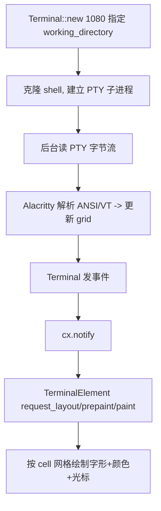

# Terminal（PTY / Alacritty 引擎 / GPUI 渲染）

Zed 内嵌终端复用 **Alacritty** 的终端仿真引擎，并在 GPUI 上自绘。三层清晰：[`terminal`](../crates/terminal)（引擎+PTY）、[`terminal_view`](../crates/terminal_view)（视图与渲染）。核心文件：`terminal/src/terminal.rs`（约 217KB）、`terminal/src/alacritty.rs`、`terminal_view/src/terminal_view.rs`、`terminal_element.rs`（约 114KB）、`terminal_panel.rs`（约 127KB）。

## 1. 三层职责

| 层 | 类型 | 位置 | 职责 |
|---|---|---|---|
| 引擎 | `Terminal` | [`terminal.rs:1501`](../crates/terminal/src/terminal.rs) | 持有 PTY 子进程 + Alacritty 状态，暴露 scroll/copy/open 等 |
| 视图 | `TerminalView` | [`terminal_view.rs:130`](../crates/terminal_view/src/terminal_view.rs) | `Entity<Terminal>` 的 GPUI 视图，实现 `Item`（L1447）可入 Pane |
| 渲染 | `TerminalElement` | [`terminal_element.rs:393`](../crates/terminal_view/src/terminal_element.rs) | 自定义 `Element`，把字符网格画到屏幕上 |
| 面板 | `TerminalPanel` | [`terminal_panel.rs:77`](../crates/terminal_view/src/terminal_panel.rs) | 底部 Dock 的宿主，内部是一个 `Pane`（L78） |

`Terminal` 内部通过 [`alacritty.rs`](../crates/terminal/src/alacritty.rs) 封装 `AlacrittyTerm`/`AlacrittyCell`/`AlacrittySearch` 等（`use crate::alacritty::{...}`，terminal.rs:64），把 alacritty_terminal 的 `Term` 适配进 Zed；PTY 由 `portable-pty` 驱动，进程信息见 `pty_info.rs`（工作目录、shell、子进程信号）。

## 2. 输出数据流（命令 → 屏幕）

1. **创建**：`Terminal::new(working_directory, ...)`（L1080）派生 shell 进程、建立伪终端，`terminal_type`（L1502）区分本地/SSH 等。
2. **读取解析**：后台任务持续从 PTY 读字节，喂给 Alacritty 的 `Term`，更新内部字符网格（`AlacrittyCell` grid）。
3. **驱动重绘**：状态变化经 `EventEmitter` 通知，`TerminalView` `cx.notify()` → GPUI 调度 `TerminalElement` 重绘。

## 3. 输入数据流（键盘 → 命令）

`TerminalView` 是 `Focusable`，键盘事件到达后转成字节写入 PTY（Ctrl/Alt/滚轮/粘贴等键位映射在 `terminal/src/mappings/`）。因终端字体/坐标与编辑器不同，命中测试由 `TerminalElement` 把鼠标像素坐标换算成 `Point{line, column}`（见 L447/L459 的点与选区类型）再交给 `Terminal`。

## 4. 渲染三阶段（TerminalElement）

`TerminalElement` 实现 GPUI 的 `Element` trait（[`terminal_element.rs:1129`](../crates/terminal_view/src/terminal_element.rs)），严格走三阶段：
- `request_layout`（L1141）：按网格尺寸算布局。
- `prepaint`（L1189）：定位各 cell、计算光标/选区几何。
- `paint`（L1603）：批量提交字形与背景，绘制光标、滚动条（`terminal_scrollbar.rs`）、超链接高亮。

这套把"终端"接入 Zed 统一 GPU 渲染管线（见 [GPUI.md](GPUI.md)、[GPUI-Internals.md](GPUI-Internals.md)）。路径类输出（如 `file.rs:10`）由 `terminal_path_like_target.rs` 识别，可点击在编辑器打开。

## 5. 作为 Dock 面板与多标签

`TerminalPanel`（L77）挂在底部 `Dock`，其 `active_pane: Entity<Pane>`（L78）里每个 tab 就是一个 `TerminalView`（`impl Item`）。`TerminalPanel::new(workspace, ...)`（L93）从 `workspace.project()` 取上下文，支持在项目根/当前目录新建终端。也可作为独立 Item 直接 split 进普通 Pane。

## 6. 关键符号速查

| 符号 | 位置 | 作用 |
|---|---|---|
| `Terminal` | `terminal/src/terminal.rs:1501` | PTY + Alacritty 引擎实体 |
| `Terminal::new` | `terminal.rs:1080` | 指定工作目录派生 shell |
| `alacritty.rs` / `AlacrittyTerm` | `terminal/src/alacritty.rs` | 终端仿真引擎适配 |
| `TerminalView` | `terminal_view/src/terminal_view.rs:130` | `Entity<Terminal>` 的 Item 视图 |
| `impl Item for TerminalView` | `terminal_view.rs:1447` | 接入 Pane/标签体系 |
| `TerminalElement` | `terminal_view/src/terminal_element.rs:393` | 自定义 Element，三阶段绘制 |
| `TerminalPanel` | `terminal_view/src/terminal_panel.rs:77` | 底部 Dock 终端容器 |

## 7. 与其他页面的关系
- 作为 `Item` 进入 Pane：[Workspace-Pane-Dock.md](Workspace-Pane-Dock.md)。
- 渲染三阶段与命中测试：[GPUI.md](GPUI.md)、[GPUI-Internals.md](GPUI-Internals.md)。
- 终端里的搜索：[Search.md](Search.md)（AlacrittySearch 路径）。
- Agent 的 `TerminalTool` 执行命令：[Agent-and-AI.md](Agent-and-AI.md)。
