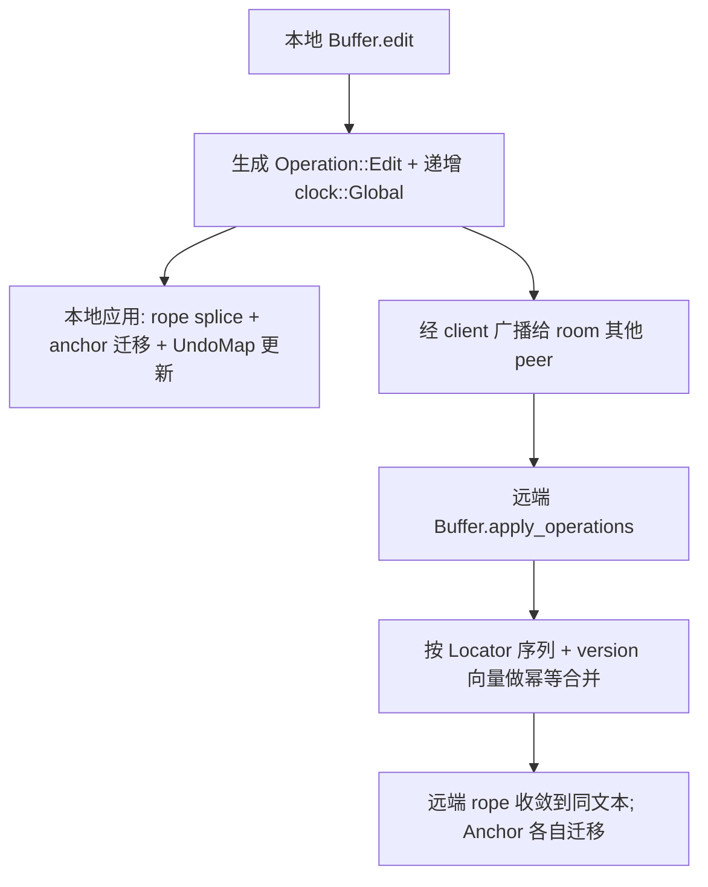

# Deep Reference: text (CRDT Buffer)

> 参考手册级：`crates/text` 的全部公开类型与核心流程。该 crate 在 [`rope`](Rope-Deep-Dive.md) 之上实现**协作式 CRDT 文本模型**：位置稳定的 `Anchor`、可合并的 `Operation`、事务化 `undo/redo`、跨 peer 的 `Patch` 同步。它被 [`language::Buffer`](Language-and-Project.md)/[`multi_buffer`](Multi-Buffer-Deep-Dive.md) 使用，是实时协作（[Collaboration](Collaboration-and-Call.md)）的文本地基。

## 1. 类型总览（真实清单）
| 类型 | 位置 | 角色 |
|---|---|---|
| `struct Buffer` | [text.rs:59](../crates/text/src/text.rs) | **可变**文本 + 操作日志 + 历史（`EntityType`，可 `cx.new`） |
| `struct BufferSnapshot` | [text.rs:113](../crates/text/src/text.rs) | 只读、可跨线程共享的快照（渲染/查询主入口） |
| `struct BufferId(NonZeroU64)` | [text.rs:72](../crates/text/src/text.rs) | buffer 唯一 id（`new(id)`/`next`/`to_proto`） |
| `type TransactionId = clock::Lamport` | [text.rs:57](../crates/text/src/text.rs) | 事务 id |
| `struct HistoryEntry` | [text.rs:127](../crates/text/src/text.rs) | undo/redo 栈元素 |
| `struct Transaction` | [text.rs:135](../crates/text/src/text.rs) | 一次可撤销的编辑组 |
| `enum Operation` | [text.rs:619](../crates/text/src/text.rs) | 日志条目：`Edit`/`Undo`/`Redo`/`SetTime`/`Ack`/`AckReplica`/`Restore`/`Buffer` |
| `struct EditOperation` / `UndoOperation` | [text.rs:625](../crates/text/src/text.rs)/[633](../crates/text/src/text.rs) | 编辑/撤销的具体负载 |
| `struct Edit<D>` | [text.rs:527](../crates/text/src/text.rs) | 泛型编辑：旧→新 的区间映射（`old_len`/`new_len`/`invert`/`flatten`） |
| `struct LineIndent` | [text.rs:641](../crates/text/src/text.rs) | 行缩进解析（`from_chunks`/`spaces`/`tabs`/`is_line_empty`/`is_line_blank`） |
| `struct EditedBufferSnapshot` | [text.rs:1681](../crates/text/src/text.rs) | 编辑事件附带的新旧快照对 |
| `struct FullOffset(pub usize)` | [text.rs:3247](../crates/text/src/text.rs) | 含"版本向量"维度的偏移 |
| `trait ToOffset` / `trait ToPoint` | [text.rs:3394](../crates/text/src/text.rs)/[3459](../crates/text/src/text.rs) |  Anything→offset/Point 的统一入参 |
| `struct Anchor` | [anchor.rs:11](../crates/text/src/anchor.rs) | 位置稳定引用（见 §4） |
| `struct Locator` | [locator.rs](../crates/text/src/locator.rs) | 稀疏序列号分配（给 operation 排序/去重） |
| `struct Patch<T>(Vec<Edit<T>>)` | [patch.rs:8](../crates/text/src/patch.rs) | 一组编辑的"位置迁移映射" |
| `enum SelectionGoal` | [selection.rs:6](../crates/text/src/selection.rs) | 选区端点吸附策略（`None`/`Hand`/`PreferTextEndColumn`/`TextEndColumn`） |
| `struct Selection<T>` | [selection.rs:18](../crates/text/src/selection.rs) | `id/ranges/reversed/goal/line_mode`（T 可为 Anchor 或 Point） |
| `struct UndoMap(SumTree<UndoMapEntry>)` | [undo_map.rs:48](../crates/text/src/undo_map.rs) | 原文位置↔当前位置映射（供 diff/语法重解析） |
| `struct Topic<T>` / `Subscription<T>` | [subscription.rs:9](../crates/text/src/subscription.rs)/[11](../crates/text/src/subscription.rs) | 订阅 buffer 编辑，增量收 `Patch` |
| `trait Operation`(op_queue) / `OperationQueue` / `OperationKey` / `OperationSummary` | [operation_queue.rs:5..](../crates/text/src/operation_queue.rs) | 待合并后台操作队列（语言服务/索引用） |
| `network.rs`：`Version{global,version}`、`republish` | [network.rs](../crates/text/src/network.rs) | 把本地操作以新时间戳转发给下游 peer |

## 2. `Buffer` 关键方法
| 方法 | 位置 | 流程 |
|---|---|---|
| `edit<R,I,S,T>(edits) -> Operation` | [text.rs:870](../crates/text/src/text.rs) | 应用一批 `(range, new_text, version)`：改 rope、生成 `Operation::Edit`、更新 `version`(clock::Global)、迁移 anchor、推进 undo |
| `start_transaction()` | [text.rs:1313](../crates/text/src/text.rs) | 开启事务组（把多次 edit 并成一个可撤销单元），返回 `TransactionId` |
| `end_transaction(cx)` / `abort_transaction` | text.rs | 提交/放弃事务 |
| `undo()` | [text.rs:1352](../crates/text/src/text.rs) | 弹出 `HistoryEntry`，生成 `Operation::Undo`，返回 `(TransactionId, Operation)` 供广播 |
| `redo()` | [text.rs:1398](../crates/text/src/text.rs) | 重做 |
| `checkpoint()` / `merge_transactions_since` | text.rs | 设置合并点（如自动保存边界） |
| `version()` | [text.rs:829](../crates/text/src/text.rs) | 当前 `clock::Global`（版本向量） |
| `snapshot()` | [text.rs:833](../crates/text/src/text.rs) | 取 `BufferSnapshot` |
| `remote_id()` | [text.rs:858](../crates/text/src/text.rs) | 协作下的远端 id |
| `apply_operations(ops)` | text.rs | 应用来自 peer 的 `Operation`（CRDT 合并，冲突无关顺序） |
| `operations_for_range(range, since)` | text.rs | 取某区间某版本后的操作（重算/回放） |
| `text_for_range(range)` | [text.rs:2300](../crates/text/src/text.rs) (Snapshot) | 区间文本 `Chunks` |
| `anchor_at(pos, bias)` | [text.rs:2630](../crates/text/src/text.rs) (Snapshot) | Point/offset → `Anchor` |
| `reserved_restore_timestamps` | text.rs | 批量 undo/redo 时间戳分配 |

## 3. CRDT 合并模型

- **无中心锁**：每个 `Operation` 带 `clock::Lamport`（`ReplicaId`+`Seq`）与因果 `version`；`OperationQueue`/`Locator` 保证收敛顺序。
- `Patch<T>`：把一批 `Edit` 组合成"旧位置→新位置"映射，用于在他人编辑后迁移本地 range/selection。

## 4. `Anchor`：位置稳定引用
[`anchor.rs`](../crates/text/src/anchor.rs)
- 字段：`timestamp_replica_id`+`timestamp_value`（**插入该文本的 operation 的 Lamport 时间戳**，内联以省 8 字节对齐）、`offset: u32`（在该 operation 插入文本内的字节偏移）、`bias: Bias`（吸附到前/后字符）、`buffer_id`。
- 语义：Anchor **不记绝对偏移**，而记"我依附于哪次插入的第几个字节"，故其后的编辑不会使其失效，只随 rope 迁移。
- API：`new(ts,offset,bias,id)`(L49)、`min_for_buffer`(L59)/`max_for_buffer`(L69)、`is_min`/`is_max`/`is_valid`、`BufferSnapshot::anchor_at`/`resolve_anchor`(Anchor→`usize`)、`ExcerptAnchor`/`multi_buffer::Anchor` 在其上加 `excerpt_id`。

## 5. 历史 / undo-redo
- `Transaction`：一段合并的编辑，`merge_in(other)`([text.rs:142](../crates/text/src/text.rs)) 把后续编辑并进同一事务；`transaction_id`(L148)。
- `HistoryEntry`：`undo_count`/`redo_count`，checkpoint 分组。
- `UndoMap`：`SumTree<UndoMapEntry>` 把"编辑前文本位置"映到"编辑后位置"（或 `Deleted`），供 `buffer_diff`/语法高亮只重解析受影响区。

## 6. 订阅与后台处理
- `Topic<Patch>`/`Subscription`：editor、lsp、edit_prediction 订阅 `Buffer`，收到 `Edit` 增量后做局部更新。
- `OperationQueue`（`SumTree<OperationItem>` + `OperationSummary`）：把需要异步重算的工作（如语言服务同步、诊断）排队按优先级消费。

## 7. 与其它 Deep 页
- 底座：[Sum-Tree-Deep-Dive.md](Sum-Tree-Deep-Dive.md)、[Rope-Deep-Dive.md](Rope-Deep-Dive.md)。
- 上层：[Multi-Buffer-Deep-Dive.md](Multi-Buffer-Deep-Dive.md)、[Editor-Deep-Dive.md](Editor-Deep-Dive.md)、[Language-and-Project.md](Language-and-Project.md)（`language::Buffer` 包 `text::Buffer`）。
- 概览：[Data-Structures.md](Data-Structures.md)。
