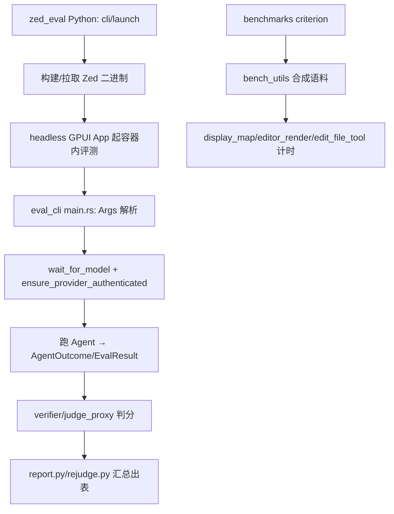

# Tooling / Evals / Benchmarks 深度解析（P-Q）

> 本页覆盖 Zed 的**离线评测（evals）**与**性能基准（benchmarks）**两条工程支撑线：`eval_cli`（AI Agent 回归评测）、`eval_utils`（评测输出契约）、`benchmarks`（criterion 微基准）、`{editor,fs,project}_benchmarks`（可执行基准）、以及 `edit_prediction_metrics`（编辑预测打分）。它们不参与运行时产品路径，却是"改内核不怕退化"的质量护栏。

## 1. 分层与设计意图

- **evals（AI 回归）**：`eval_cli` 是 Rust `main.rs`（headless 起 GPUI + Project + Agent 跑单个评测），外围 `zed_eval/` 是 Python 编排器（批量拉起 Docker/构建、判分、重判、出报表）。`eval_utils` 定义被评测代码复用的"结果契约"。
- **benchmarks（性能护栏）**：`benchmarks` crate 用 criterion 注册 `benches/*.rs`；`bench_utils` 负责**合成测试语料**（随机 Rust 文件），保证基准可复现。`{editor,fs,project}_benchmarks` 是各自独立的 `main.rs` 可执行基准。
- **edit_prediction_metrics（打分库）**：把"预测 vs 期望补丁"折算成分类指标（precision/recall/F1、ΔChr-F）与反转率（reversal ratio），供 eval/prediction 侧消费。

## 2. 类型与入口总览（符号 + 文件:行号）

### 2.1 eval_cli（Rust 侧）

| 符号 | 位置 | 角色 |
|---|---|---|
| `struct Args` | [main.rs:66](file:///e:/Rust/zed/crates/eval_cli/src/main.rs) | clap 参数（模型/指令/并发…） |
| `enum AgentOutcome` | [main.rs:110](file:///e:/Rust/zed/crates/eval_cli/src/main.rs) | Agent 运行结果分类 |
| `struct EvalResult` | [main.rs:117](file:///e:/Rust/zed/crates/eval_cli/src/main.rs) | 单条评测输出 |
| `struct RunStats` | [main.rs:148](file:///e:/Rust/zed/crates/eval_cli/src/main.rs) | 聚合统计 |
| `fn main` | [main.rs:164](file:///e:/Rust/zed/crates/eval_cli/src/main.rs) | 入口：headless App + 逐评测 |
| `fn apply_openai_compatible_providers` | [main.rs:355](file:///e:/Rust/zed/crates/eval_cli/src/main.rs) | 注入 OpenAI 兼容 provider JSON |
| `fn read_instruction` | [main.rs:391](file:///e:/Rust/zed/crates/eval_cli/src/main.rs) | 读取任务指令 |
| `fn wait_for_model` | [main.rs:420](file:///e:/Rust/zed/crates/eval_cli/src/main.rs) | 等待模型可用 |
| `fn ensure_provider_authenticated` | [main.rs:450](file:///e:/Rust/zed/crates/eval_cli/src/main.rs) | 校验 provider 鉴权 |
| `fn find_available_model` | [main.rs:466](file:///e:/Rust/zed/crates/eval_cli/src/main.rs) | 解析选定模型 |

> `headless.rs`（[src/headless.rs](file:///e:/Rust/zed/crates/eval_cli/src/headless.rs)）提供无窗口 GPUI 平台，使评测能在 CI/容器内跑。

### 2.2 zed_eval（Python 编排层）

`eval_cli/zed_eval/` 是随附的 Python 包：`cli.py`(26KB)/`launch.py`(24KB) 编排启动、`agent.py`(21KB)/`pier_agent.py` 对接被测 Agent、`modal_app.py`(36KB) 云端算力、`report.py`(17KB) 出报表、`rejudge.py`(13KB) 重判分、`verifier.py`/`judge_proxy.py` 判分代理、`builds.py`/`baseline.py`/`benchmarks.py` 构建与基线。Rust `main.rs` 只是被它调度的"单评测执行器"。

### 2.3 eval_utils（结果契约）

`enum OutcomeKind`（[:24](file:///e:/Rust/zed/crates/eval_utils/src/eval_utils.rs)）、`trait EvalOutputProcessor`（[:30](file:///e:/Rust/zed/crates/eval_utils/src/eval_utils.rs)）、`struct EvalOutput<M>`（[:37](file:///e:/Rust/zed/crates/eval_utils/src/eval_utils.rs)，含 `passed`:44/`failed`:52）、`struct NoProcessor`（[:61](file:///e:/Rust/zed/crates/eval_utils/src/eval_utils.rs)）、入口 `fn eval`（[:70](file:///e:/Rust/zed/crates/eval_utils/src/eval_utils.rs)）。

### 2.4 benchmarks（criterion）

`bench_utils.rs`：`rust_file_line_count`（[:8](file:///e:/Rust/zed/crates/benchmarks/src/bench_utils.rs)）/`random_rust_file`（[:12](file:///e:/Rust/zed/crates/benchmarks/src/bench_utils.rs)）合成语料、`rust_identifier`（[:79](file:///e:/Rust/zed/crates/benchmarks/src/bench_utils.rs)）。`benches/` 注册 4 个基准：`display_map.rs`、`editor_render.rs`、`edit_file_tool.rs`、`markdown_renderer.rs`。

### 2.5 独立可执行基准

`editor_benchmarks/src/main.rs`（`parse_args`:21/`main`:71）、`project_benchmarks/src/main.rs`（`download_server_binary_locally`:79/`main`:95）、`fs_benchmarks/src/main.rs`（`main`:5）。

### 2.6 edit_prediction_metrics（打分库）

| 文件 | 关键符号 |
|---|---|
| prediction_score.rs | `PredictionScore`[:24](file:///e:/Rust/zed/crates/edit_prediction_metrics/src/prediction_score.rs)、`score_prediction`[:213](file:///e:/Rust/zed/crates/edit_prediction_metrics/src/prediction_score.rs)、`prepare_expected_patches`[:154](file:///e:/Rust/zed/crates/edit_prediction_metrics/src/prediction_score.rs) |
| patch_metrics.rs | `ClassificationMetrics`[:17](file:///e:/Rust/zed/crates/edit_prediction_metrics/src/patch_metrics.rs)、`precision/recall/f1`[:58/66/74](file:///e:/Rust/zed/crates/edit_prediction_metrics/src/patch_metrics.rs)、`DeltaChrFMetrics`[:107](file:///e:/Rust/zed/crates/edit_prediction_metrics/src/patch_metrics.rs) |
| summary.rs | `QaSummaryData`[:8](file:///e:/Rust/zed/crates/edit_prediction_metrics/src/summary.rs)、`compute_summary`[:285](file:///e:/Rust/zed/crates/edit_prediction_metrics/src/summary.rs) |
| reversal.rs | `compute_prediction_reversal_ratio_from_history`[:746](file:///e:/Rust/zed/crates/edit_prediction_metrics/src/reversal.rs) |
| tree_sitter.rs | `count_tree_sitter_errors`[:1](file:///e:/Rust/zed/crates/edit_prediction_metrics/src/tree_sitter.rs) |

## 3. 评测执行流程

## 4. 集成点

- **eval ↔ Agent**：`AgentOutcome`/`EvalResult` 直接消费 [Agent 深页](Agent-Deep-Dive) 的 `NativeAgent`/`Thread`；provider 注入对接 [Model-Providers 深页](Model-Providers-Deep-Dive)。
- **metrics ↔ 预测**：`edit_prediction_metrics` 为 [Edit-Prediction-UI-CLI 深页](Edit-Prediction-UI-CLI-Deep-Dive) 的 `edit_prediction_cli` 离线评测提供打分。
- **benchmarks ↔ 内核**：`display_map`/`editor_render` 基准守护 [Editor 深页](Editor-Deep-Dive) 与 [Text-Buffer](Text-Buffer-Deep-Dive)/[Sum-Tree](Sum-Tree-Deep-Dive) 的性能不回退。

## 5. 相关页

- 概览：[Tooling-Evals-Utilities](Tooling-Evals-Utilities)
- 深页：[Agent-Deep-Dive](Agent-Deep-Dive)、[Edit-Prediction-UI-CLI-Deep-Dive](Edit-Prediction-UI-CLI-Deep-Dive)、[Model-Providers-Deep-Dive](Model-Providers-Deep-Dive)
