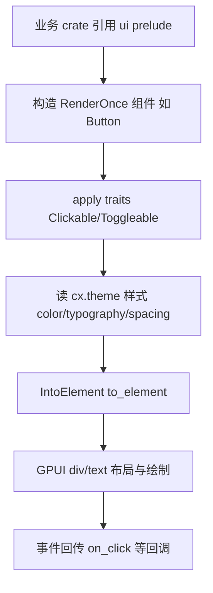

# UI 原语与组件库 深入解析（Deep Dive）

> 本页覆盖 `ui` crate——Zed 所有可视组件的共享底座（`crates/ui/src`）。它与 GPUI（渲染框架，见 GPUI 页）互补：GPUI 提供 `Element`/`Render`/布局引擎，`ui` 在其上封装主题样式系统 + 一套 `RenderOnce` 组件。关联 crate：`ui_macros`（`register_component`）、`story_book`（组件预览）。

## 1. 分层设计

`ui.rs`(1-21) 是装配点，导出四个子模块 + prelude：

- **样式层** `styles/`：把 `theme`（`Theme`/`Colors`）映射成 GPUI 的 `Hsla` 颜色、`TextStyle`、间距、圆角、动画。`styles.rs`(1-18) 汇总 `animation/appearance/color/elevation/platform/severity/spacing/typography/units`。
- **trait 层** `traits/`：给 GPUI 元素链式加交互——`Clickable`/`Selectable`/`Toggleable`/`Disableable`/`Fixed`/`Transformable`/`VisibleOnHover`/`StyledExt`/`AnimationExt`。
- **组件层** `components/`（51 项）：每个是一个 `#[derive(IntoElement)] struct` 的 `RenderOnce` 组件（Button/Label/List/Modal/Tab/Scrollbar/Toggle/…）。
- **工具层** `utils/`：`CornerSolver`（嵌套圆角递减）、`format_distance`（相对时间）、`color_contrast`（WCAG 对比度）、`replace_control_characters`、`WithRemSize`、`SearchInputWidth` 等。
- **预导出** `prelude.rs` / `component_prelude.rs`：组件文件顶上一行 `use ...prelude::*` 引入全部 trait + 常用组件 + `Reveal`/`ParentElement`。

## 2. 组件总览（`components/`）

| 组件 | 文件 | 角色 |
| --- | --- | --- |
| `Button`(+variants/story) | button/ | 最常用；多 `ButtonVariants`/`ButtonSize`/`ButtonShape` |
| `Label`/`Singleton`/`Highlighted` | label/ | 文本，`LabelCommon` 统一样式 |
| `ListItem`/`List`/`FixedMenu`/`ContextualMenu` | list/ | 选择器/菜单行 |
| `ContextMenu` | context_menu.rs(95KB) | 右键菜单，`ContextualMenu` 元素 |
| `PopoverMenu`/`DropdownMenu`/`RightClickMenu` | *_menu.rs | 弹出菜单族 |
| `Modal`/`AlertModal` | modal.rs | 模态框，`ModalContent`/`ModalFooter` |
| `Tab`/`TabBar` | tab.rs/tab_bar.rs | 编辑器标签 |
| `Scrollbar` | scrollbar.rs(59KB) | 自绘滚动条 + `ScrollbarLayout` |
| `Toggle`/`ToggleRow` | toggle.rs(40KB) | 设置项开关 |
| `Keybinding`/`KeybindingHint` | keybinding*.rs | 键位胶囊 |
| `Facepile`/`Avatar` | facepile.rs/avatar.rs | 协作者头像堆叠 |
| `Callout`/`Banner`/`Chip`/`CountBadge`/`Indicator` | *.rs | 提示/徽章 |
| `DiffStat` | diff_stat.rs | +/- 行数统计条 |
| `IndentGuides` | indent_guides.rs | 缩进参考线绘制 |
| `RedistributableColumns` | redistributable_columns.rs | 可调宽列 |
| `StickyItems`/`Navigable`/`TreeViewItem` | *.rs | 列表导航原语 |
| `Divider`/`Group`/`Stack`/`Disclosure` | *.rs | 布局/折叠 |
| `EmptyState` 等 | ai/、project_empty_state.rs | AI 图标 + 空状态 |

## 3. 样式系统（`styles/`）

| 符号 | 文件 | 角色 |
| --- | --- | --- |
| `Color` 扩展 / `cx.theme().status()` | color.rs | 语义色→`Hsla` |
| `TextStyle` 生成 | typography.rs | `text_sm()`/`font_bold()` 等 |
| `Spacing`/rems | spacing.rs/units.rs | rem 基准间距 |
| `Animation`/`AnimationExt` | animation.rs + traits/animation_ext.rs | 悬停/按压补间 |
| `Elevation` | elevation.rs | 阴影层级 |
| `Severity` | severity.rs | 诊断严重度色 |
| `Appearance` | appearance.rs | 明暗 |
| `platform` | platform.rs | 平台差异（macOS 圆角等） |

## 4. 交互 trait（`traits/`）—— 链式构建的关键

GPUI 元素通过 `Styled` 布局，`ui` 的 trait 在其上加"交互态"。`StyledExt`(styled_ext.rs) 提供 `.text_…()`/`.bg_…()`/`.id_…()` 语义糖；`Clickable`(clickable.rs)/`Selectable`/`Toggleable`(toggleable.rs)/`Disableable`(disableable.rs)/`Fixed`(fixed.rs)/`Transformable`/`VisibleOnHover` 各自 `impl<T: InteractiveText> ...`，最终把状态色与 `Hoverable`/`Selectable` 行为织入子元素。典型写法：

```rust
div().id("x").child(Button::new("ok", "OK").primary()).into_any_element()
```

## 5. 工具函数（`utils/`）

| 符号 | 文件:行 | 角色 |
| --- | --- | --- |
| `struct CornerSolver` | corner_solver.rs:25 | 嵌套容器圆角逐层递减 |
| `fn inner_corner_radius(..)` | corner_solver.rs:11 | 计算子圆角 |
| `fn calculate_contrast_ratio(fg,bg)` | color_contrast.rs:10 | WCAG 对比度 |
| `fn platform_title_bar_height(..)` | constants.rs:17 | 平台标题栏高 |
| `fn replace_control_characters(text)` | control_characters.rs:57 | 控制字符可视化 |
| `struct FormatDistance` | format_distance.rs:24 | 相对时间格式化(`from_now`:43) |
| `fn format_distance(..)` | format_distance.rs:233 | 距离时间串 |
| `struct WithRemSize` | with_rem_size.rs:8 | 强制 rem 基准上下文 |
| `struct SearchInputWidth`/`calc_width` | search_input.rs:3/:13 | 搜索框自适应宽 |

## 6. 渲染流程



## 7. 集成点

- 几乎所有 UI crate（`assistant`/`editor`/`project_panel`/`settings_ui`/…）`use ui::prelude::*`，组件是它们与 GPUI 之间的唯一词汇层。
- `theme` crate 提供 `Theme`/`ThemeStyles`；`ui/styles` 是 `theme`→GPUI 绘制属性的转换层。
- `ui_macros` 提供 `register_component!`，`component_prelude`/`story_book` 用它在预览簿枚举组件。
- `icons` crate 提供 `Icon`/`IconName`，`components/icon.rs` 封装成 `IconButton`/`DecoratedIcon`。

## 8. 相关页

- [GPUI-Deep-Dive](GPUI-Deep-Dive.md)（底层 `Element`/`Render`/`Styled`）
- [GPUI-Macros-and-Utilities-Deep-Dive](GPUI-Macros-and-Utilities-Deep-Dive.md)（`derive IntoElement`/`RenderOnce`/`Refineable`）
- [Settings-and-Themes](Settings-and-Themes.md)（主题/外观概览）
- [Panels-Deep-Dive](Panels-Deep-Dive.md)（用这些组件构建的面板）
