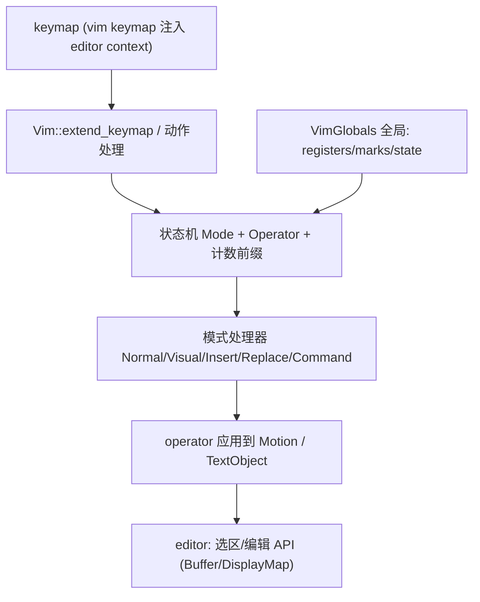
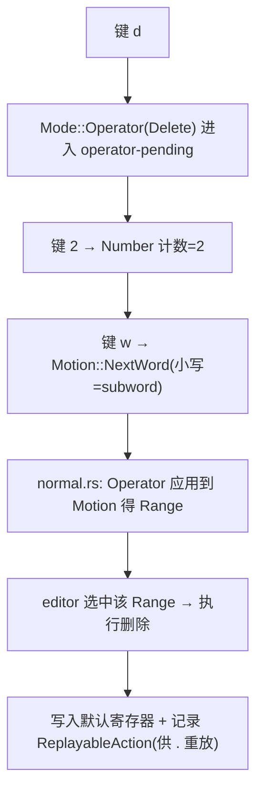

# Vim 深挖（模态编辑 · 运算符-运动-文本对象 · Helix 增强）

> 返回 [Home](Home) · [Module-Index](Module-Index)
>
> 概览见 [Vim-and-Key-Input.md](Vim-and-Key-Input.md)。本页是**函数/类型级参考手册**，覆盖 `vim` crate——Zed 的 Vim 模拟层（作为 editor 的模态扩展）。`vim` 是本仓最大的 UI crate 之一（`motion.rs` 188KB / `helix.rs` 170KB / `object.rs` 137KB / `command.rs` 126KB）。所有符号均来自 `grep`/`read` 确证（`文件:行号`）。

## 1. 分层与接入

Vim 不是独立编辑器，而是**挂在 `Workspace`/`Editor` 上的模态覆盖层**：`fn init(cx)`(vim.rs:286) 里 `VimGlobals::register(cx)`(287) 注册全局、注入 keymap、订阅 editor 事件。

## 2. 核心状态（`state.rs` 68KB · `vim.rs` 93KB）

| 类型 | 位置 | 角色 |
| --- | --- | --- |
| `impl Vim` | vim.rs:566 | 每 editor 的 Vim 行为主体（动作处理器集合）；`struct Vim` 持模式相关瞬态 |
| `struct VimGlobals` | state.rs:250 | **全局单例**（`register` 于 vim.rs:287）：`registries`/`marks`/`SearchState`/operator-pending 等跨 editor 共享 |
| `enum Mode` | state.rs:44 | `Normal`/`Insert`/`Visual`/`VisualLine`/`VisualBlock`/`Replace`/`Operator{past_count}` |
| `enum Operator` | state.rs:94 | `Delete`/`Change`/`Yank`/`Indent`/`Object`/`Replace`(注册 `.` 重放)… |
| `enum RecordedSelection` | state.rs:190 | 可视选择记录（`Lines`/`Block{width}`） |
| `struct Register` / `struct RegistersView` | state.rs:210 / 1376 | 命名寄存器 + 寄存器浏览器（`RegistersViewDelegate` 1259） |
| `struct MarksState` / `enum Mark` / `MarkLocation` | state.rs:291 / 310 / 305 | 文件内/全局标记（`A-Z`、`` ` ``、`'`） |
| `struct SearchState` | state.rs:1062 | `/`、`?`、`*`、`#` 当前搜索与方向 |
| `enum ReplayableAction` | state.rs:1038 | 可被 `.`（dot-repeat）重放的编辑动作 |

`vim.rs` 动作（`Push*` 结构）：`Number`(74) 计数前缀、`PushObject`(83)、`PushFindForward`/`Backward`(90/98)、`PushSneak`/`SneakBackward`(122/129)、`PushAddSurrounds`/`PushChangeSurrounds`(136/141)、`PushJump`(148, helix easy-motion)、`PushDigraph`(155)、`PushLiteral`(162)、`SelectRegister`(78)。

## 3. 模式处理器

| 文件 | 大小 | 职责 |
| --- | --- | --- |
| `normal.rs` | 87KB | 普通模式动作、operator-pending 组合、`dot repeat` |
| `visual.rs` | 75KB | 可视（字符/行/块）选择与变换（`U`/`u`/`J`…） |
| `insert.rs` | 8.8KB | 插入模式（含 `Ctrl-W`/`Ctrl-A`/normal-mode 回退） |
| `replace.rs` | 20.8KB | `R` 替换模式（含多字符替换队列） |
| `command.rs` | 126KB | 冒号命令 `:`（`%s/…/…`、`:w`、`:q`、`:sort`、marks…）大解析器 |
| `mode_indicator.rs` | 7.4KB | 状态栏模式徽标 |

## 4. 运动 / 文本对象（`motion.rs` 188KB · `object.rs` 137KB）

- `enum Motion`（motion.rs:46）：完整运动集合（`Left`/`Words`/`SubWords`/`Parentheses`/`Brackets`/`WholeLines`/`FindForward`/`TillCharacter`/`NextWord`/`Scroll`/`FirstNonBlank`/`EndOfLine`/`Indent`…）。
- `object.rs`：文本对象 `it`/`at`（`inner/around` word、sentence、paragraph、quote、bracket、`function`、`comment`、`tag`…），由 `PushObject`(vim.rs:83) 驱动。
- operator × motion / text-object 的矩阵由 `normal.rs` 组合，落到 `editor` 选区与 `Buffer` 编辑。

## 5. Helix 增强 / 环绕 / 双字符

| 文件/目录 | 大小 | 特性 |
| --- | --- | --- |
| `helix.rs` + `helix/`(6) | 170KB | **Helix 风格增强**：easy-motion 跳转标签（`HelixJumpLabel` state.rs:176 / `HelixJumpBehaviour` 182）、`duplicate`（`helix/duplicate.rs`，`Direction` enum）、多光标选择 |
| `surrounds.rs` | 62KB | `cs`/`ds`/`ys` 环绕增删改 |
| `digraph.rs` + `digraph/` | 13KB | Unicode 双字符输入（`Ctrl-K`） |
| `change_list.rs` | 6.6KB | Vim 风格 `g;`/`g,` 变更列表（区别于 `.`） |
| `indent.rs` / `rewrap.rs` | 8.7KB / 5.9KB | 缩进操作 / 重排段落 `gq` |

## 6. 测试框架（特色 · `test.rs` 96KB + `test/`）

Zed Vim 用**差分测试**对齐真实 Neovim：`NeovimBackedTestContext`(test/neovim_backed_test_context.rs:15，`new`/`new_html`/`new_typescript`… 139-231) 会驱动一个真实 `nvim` 进程作为"金标准"，`VimTestContext` 做纯 GPUI 断言。每个模式文件尾部都有大量 `#[gpui::test]` + `NeovimBackedTestContext::new(cx)`（见 visual.rs 945+）。

## 7. 一次 `d2w`（删两个词）的流程

## 8. 集成 / 相关页

- 依赖：`editor`（选区/动作/`DisplayMap`）、`language`、`settings`（`VimSettings`）、`workspace`（keymap context）；`gpui` 动作系统。
- keymap 资源：`assets/keymaps/vim.json`。
- 深页：[Editor-Deep-Dive.md](Editor-Deep-Dive.md)、[GPUI-Deep-Dive.md](GPUI-Deep-Dive.md)、[Settings-and-Onboarding-Deep-Dive.md](Settings-and-Onboarding-Deep-Dive.md)
- 概览：[Vim-and-Key-Input.md](Vim-and-Key-Input.md)
- 导航：[Home](Home) · [Module-Index](Module-Index)
