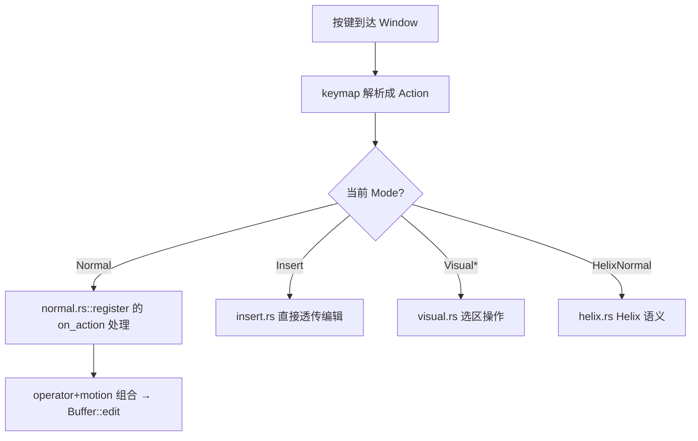

# Vim & Key Input（Vim 模式 / which-key / 键位编辑器）

本页覆盖三个"键位输入"相关模块：[`vim`](../crates/vim)（Vim/Helix 模态编辑）、[`which_key`](../crates/which_key)（键序列提示浮层）、[`keymap_editor`](../crates/keymap_editor)（可视化编辑 keymap）。它们都建立在 GPUI 的 [keymap / Action 分发](GPUI-Internals.md#5-输入与-action-分发) 之上。

## 1. 模块族职责

| Crate | 类型 | 位置 | 职责 |
|---|---|---|---|
| `vim` | `Vim` | [`vim.rs:516`](../crates/vim/src/vim.rs) | 作为 `Entity` 挂在 Editor 上，实现模态编辑 |
| `vim` | `enum Mode` | [`state.rs:44`](../crates/vim/src/state.rs) | Normal/Insert/Replace/Visual/VisualLine/VisualBlock/HelixNormal/HelixSelect |
| `vim` | `ModeIndicator` | [`mode_indicator.rs:10`](../crates/vim/src/mode_indicator.rs) | 底部状态栏模式显示 |
| `which_key` | `WhichKeyModal` | [`which_key_modal.rs:19`](../crates/which_key/src/which_key_modal.rs) | 展示"下一步可按的键"的浮层 |
| `which_key` | `PendingKeystrokesIndicator` | [`pending_keystrokes_indicator.rs:23`](../crates/which_key/src/pending_keystrokes_indicator.rs) | 显示当前已按下的键序列 |
| `keymap_editor` | `KeymapEditor` | [`keymap_editor.rs:432`](../crates/keymap_editor/src/keymap_editor.rs) | 键位绑定编辑视图 |
| `keymap_editor` | `KeystrokeInput` | [`keystroke_input.rs:44`](../crates/keymap_editor/src/ui_components/keystroke_input.rs) | 录制按键的输入控件 |

## 2. Vim：如何"劫持"编辑器输入

Zed 的 Vim 不是外部进程，而是一个附加到 `Editor` 的 `Entity<Vim>`。启用后（`vim_mode_setting` 控制），[`vim::register`](../crates/vim/src/vim.rs)（vim.rs:620）在 Editor 上注册；核心是**把 GPUI 的 Action 用 `cx.on_action` 接到 Vim 语义**上。每个模式/功能文件都暴露一个 `register(editor, cx)`：

关键文件（均含 `register`，把 Action 绑到 `Context<Vim>`）：
- [`state.rs`](../crates/vim/src/state.rs)：`Vim` 状态机与 `switch_mode`（[L1208](../crates/vim/src/vim.rs)）——模式切换中枢；`Mode`(state.rs:44) 决定按键解释方式。
- [`motion.rs`](../crates/vim/src/motion.rs)（~188KB）：移动类操作（`w`/`b`/`e`/`f`/搜索跳转…），`register`(L423)。
- [`normal.rs`](../crates/vim/src/normal.rs) + `normal/{search,substitute,repeat,increment,scroll}.rs`：普通模式的删除/替换/计数/滚动等。
- [`object.rs`](../crates/vim/src/object.rs)：文本对象（`iw`/`ap`/引号块），`register`(L455)。
- [`visual.rs`](../crates/vim/src/visual.rs) / [`replace.rs`](../crates/vim/src/replace.rs) / [`insert.rs`](../crates/vim/src/insert.rs)：可视/替换/插入模式。
- [`command.rs`](../crates/vim/src/command.rs)：冒号命令（`:w`/`:q`/`:%s`），`register`(L287)。
- [`surrounds.rs`](../crates/vim/src/surrounds.rs) / [`change_list.rs`](../crates/vim/src/change_list.rs)（`;`/`,`）/ [`digraph.rs`](../crates/vim/src/digraph.rs) / [`rewrap.rs`](../crates/vim/src/rewrap.rs) / [`indent.rs`](../crates/vim/src/indent.rs)：扩展行为。
- [`helix.rs`](../crates/vim/src/helix.rs)（~170KB）：**Helix 风格**键位（选择优先），`Mode::HelixNormal/HelixSelect`。

operator-motion 组合：Vim 把"动词（`d`/`c`/`y`）+ 目标（motion/text object）"拆成两段状态，`Vim` 暂存待处理 operator，收到 motion 后再对 `Editor` 选择集求值并触发 [`Buffer::edit`](Editing-Deep-Dive.md)。测试用 [`test.rs`](../crates/vim/src/test.rs) 的 neovim 对照框架（`test_neovim`）跑一致性。

## 3. which-key：键序列发现浮层

面向"记不住快捷键"的场景：当用户按下一个**前缀键**（如 `g`、`<space>`）且该前缀还需后续键才能构成完整绑定，[`which_key::init`](../crates/which_key/src/which_key.rs)（L79）挂上观察器，弹出 `WhichKeyModal`（which_key_modal.rs:19），列出该前缀下所有可用后续键及其 Action 名。

- `include_binding: FnMut(&KeyBinding) -> bool`（which_key.rs:58）：过滤哪些绑定参与展示。
- `PendingKeystrokesIndicator`（pending_keystrokes_indicator.rs:23）：状态栏实时显示"已按下的未完成键序列"，实现 `StatusItemView`（L377）+ popover 状态（`PopoverState` L39）。
- `WhichKeySettings`（which_key_settings.rs:4，`impl Settings`）：阈值/是否启用等。

它读取的是 GPUI keymap 的 `KeyBinding` 树——因此与用户自定义键位天然一致。

## 4. keymap_editor：可视化编辑键位

`KeymapEditor`（keymap_editor.rs:432）提供 GUI 编辑 keymap.json：左侧选上下文（context）、中间列绑定、右侧改键。

- `KeystrokeInput`（keystroke_input.rs:44）：捕获用户按下的一组修饰+键，生成 `Keystroke`。
- `ActionCompletionProvider`（action_completion_provider.rs:9）：为绑定动作提供补全（列出全部注册 Action）。
- `KeybindingEditorDb`（keymap_editor.rs:3986）：持久化未保存编辑（基于 [db/sqlez](Module-Index.md)，见持久化族）。
- 写回的是 `assets/keymaps/*` 与用户 `keymap.json`，GPUI 重新加载后即生效。

## 5. 关键符号速查

| 符号 | 位置 | 作用 |
|---|---|---|
| `Vim` | `vim/src/vim.rs:516` | 模态编辑状态实体 |
| `vim::register` | `vim.rs:620` | 向 Editor 安装 Vim |
| `Vim::switch_mode` | `vim.rs:1208` | 模式切换 |
| `enum Mode` | `vim/src/state.rs:44` | 8 种编辑模式 |
| `motion::register` | `vim/src/motion.rs:423` | 注册移动操作 |
| `object::register` | `vim/src/object.rs:455` | 文本对象 |
| `ModeIndicator` | `vim/src/mode_indicator.rs:10` | 模式指示 |
| `which_key::init` | `which_key/src/which_key.rs:79` | 安装键提示 |
| `WhichKeyModal` | `which_key/src/which_key_modal.rs:19` | 前缀键候选浮层 |
| `PendingKeystrokesIndicator` | `which_key/src/pending_keystrokes_indicator.rs:23` | 待完成键序列指示 |
| `KeymapEditor` | `keymap_editor/src/keymap_editor.rs:432` | 键位编辑视图 |
| `KeystrokeInput` | `keymap_editor/src/ui_components/keystroke_input.rs:44` | 按键录制控件 |

## 6. 与其他页面的关系
- 底层 keymap/Action 分发：[GPUI-Internals.md](GPUI-Internals.md)。
- operator-motion 最终落到 `Buffer::edit`：[Editing-Deep-Dive.md](Editing-Deep-Dive.md)。
- 键位设置属于分层设置：[Settings-and-Themes.md](Settings-and-Themes.md)。
- `vim_mode_setting` 开关：见 [Module-Index.md](Module-Index.md) 第 17 类。
