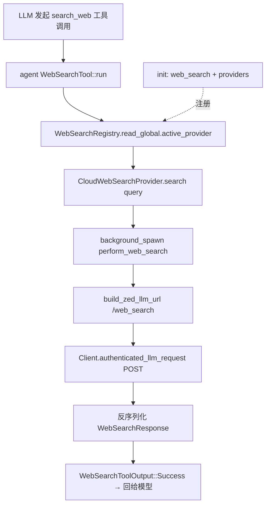

# Web Search 能力栈 深度解析（P-R）

> 本页覆盖 Zed 的**联网搜索能力**：`web_search`（provider 抽象与注册中心）、`web_search_providers`（zed.dev 云端实现）、`cloud_llm_client` 的搜索请求/响应 schema、`agent` 侧的 `WebSearchTool`，以及 `settings_ui` 的工具授权配置页。它是 Agent"能查资料"这条链路的底座。
>
> 注：**项目内文本搜索**（`search` crate / `BufferSearchBar` / `ProjectSearch`）另见 [Search-Deep-Dive](Search-Deep-Dive)，与本页的"外网搜索"是两回事。

## 1. 分层与设计意图

- **抽象层 `web_search`**：定义 `trait WebSearchProvider` 与全局 `WebSearchRegistry`（`Global` 包装 `Entity`），用"注册/激活/注销 provider"的插件式结构解耦"谁来搜"。
- **实现层 `web_search_providers`**：`CloudWebSearchProvider` 通过 `Client` 走 zed.dev 的 LLM 网关 `/web_search`，鉴权依赖 `global_llm_token` 与当前 organization。
- **消费层 `agent`**：`WebSearchTool` 实现 `AgentTool`，把 LLM 的 `search_web` 工具调用翻译成 `WebSearchRegistry.active_provider().search(...)`，返回 `WebSearchResponse` 给模型。

## 2. 类型总览（符号 + 文件:行号）

### 2.1 web_search（抽象 + 注册中心）

| 符号 | 位置 | 角色 |
|---|---|---|
| `fn init` | [web_search.rs:8](file:///e:/Rust/zed/crates/web_search/src/web_search.rs) | 建 `WebSearchRegistry` 并 `set_global` |
| `struct WebSearchProviderId` | [web_search.rs:14](file:///e:/Rust/zed/crates/web_search/src/web_search.rs) | newtype(SharedString)，可 Hash/Ord |
| `trait WebSearchProvider` | [web_search.rs:16](file:///e:/Rust/zed/crates/web_search/src/web_search.rs) | `id`(17)/`search`(18)→`Task<Result<WebSearchResponse>>` |
| `struct GlobalWebSearchRegistry` | [web_search.rs:21](file:///e:/Rust/zed/crates/web_search/src/web_search.rs) | `Global` 包装 `Entity<WebSearchRegistry>` |
| `struct WebSearchRegistry` | [web_search.rs:26](file:///e:/Rust/zed/crates/web_search/src/web_search.rs) | `providers: HashMap` + `active_provider` |
| `fn global` / `read_global` | [web_search.rs:32/36](file:///e:/Rust/zed/crates/web_search/src/web_search.rs) | 取全局注册表 |
| `fn providers` / `active_provider` | [web_search.rs:40/44](file:///e:/Rust/zed/crates/web_search/src/web_search.rs) | 枚举/取当前 provider |
| `fn set_active_provider` | [web_search.rs:48](file:///e:/Rust/zed/crates/web_search/src/web_search.rs) | 设为默认并登记 |
| `fn register_provider` | [web_search.rs:53](file:///e:/Rust/zed/crates/web_search/src/web_search.rs) | 插入；首个自动成为 active |
| `fn unregister_provider` | [web_search.rs:66](file:///e:/Rust/zed/crates/web_search/src/web_search.rs) | 移除并清理 active |

### 2.2 web_search_providers（zed.dev 云实现）

- `fn init(client, user_store, cx)`（[web_search_providers.rs:9](file:///e:/Rust/zed/crates/web_search_providers/src/web_search_providers.rs)）构造并注册 provider。
- `struct CloudWebSearchProvider`（[cloud.rs:13](file:///e:/Rust/zed/crates/web_search_providers/src/cloud.rs)）/`new`（[:18](file:///e:/Rust/zed/crates/web_search_providers/src/cloud.rs)）持有 `Entity<State>`。
- `struct State`（[:25](file:///e:/Rust/zed/crates/web_search_providers/src/cloud.rs)）= `Client` + `UserStore` + `LlmApiToken`（`global_llm_token`:33）。
- `impl WebSearchProvider`（[:45](file:///e:/Rust/zed/crates/web_search_providers/src/cloud.rs)）：`id`= `ZED_WEB_SEARCH_PROVIDER_ID`("zed.dev", :43)；`search`（[:50](file:///e:/Rust/zed/crates/web_search_providers/src/cloud.rs)）`background_spawn` 调 `perform_web_search`。
- `async fn perform_web_search`（[:66](file:///e:/Rust/zed/crates/web_search_providers/src/cloud.rs)）：`build_zed_llm_url("/web_search")`（:74）+ `authenticated_llm_request` POST + 反序列化 `WebSearchResponse`。

### 2.3 cloud_llm_client（schema）

`struct WebSearchBody`（[cloud_llm_client.rs:275](file:///e:/Rust/zed/crates/cloud_llm_client/src/cloud_llm_client.rs)，含 `query`）、`struct WebSearchResponse`（[:280](file:///e:/Rust/zed/crates/cloud_llm_client/src/cloud_llm_client.rs)）、`struct WebSearchResult`（[:285](file:///e:/Rust/zed/crates/cloud_llm_client/src/cloud_llm_client.rs)）。

### 2.4 agent 工具与授权

- `struct WebSearchToolInput`（[web_search_tool.rs:22](file:///e:/Rust/zed/crates/agent/src/tools/web_search_tool.rs)）、`enum WebSearchToolOutput`（[:29](file:///e:/Rust/zed/crates/agent/src/tools/web_search_tool.rs)，`Success`/`Error`）、`struct WebSearchTool`（[:45](file:///e:/Rust/zed/crates/agent/src/tools/web_search_tool.rs)）`impl AgentTool`（[:47](file:///e:/Rust/zed/crates/agent/src/tools/web_search_tool.rs)）。
- 授权配置页：`render_web_search_tool_config`（[settings_ui/pages/tool_permissions_setup.rs:1391](file:///e:/Rust/zed/crates/settings_ui/src/pages/tool_permissions_setup.rs)，映射自 `"search_web"`:313）。

## 3. 调用流程

## 4. 集成点

- **鉴权/网关**：`perform_web_search` 复用 [Network-HTTP 深页](Network-HTTP-Deep-Dive) 的 `build_zed_*_url` 与 [Collab 深页](Collab-Deep-Dive) 的 `Client::authenticated_llm_request`；token 来自 [Model-Providers 深页](Model-Providers-Deep-Dive) 的 `global_llm_token`。
- **Agent 工具链**：`WebSearchTool` 是 [Agent 深页](Agent-Deep-Dive) 31 个工具之一，输出经 `LanguageModelToolResultContent` 回灌模型。
- **可扩展性**：任何 provider 只要实现 `WebSearchProvider` 并 `register_provider` 即可接入（当前内置仅 zed.dev 云实现）。

## 5. 相关页

- 概览：[Agent-and-AI](Agent-and-AI)、[Network-And-HTTP](Network-And-HTTP)、[Search](Search)
- 深页：[Agent-Deep-Dive](Agent-Deep-Dive)、[Model-Providers-Deep-Dive](Model-Providers-Deep-Dive)、[Network-HTTP-Deep-Dive](Network-HTTP-Deep-Dive)、[Search-Deep-Dive](Search-Deep-Dive)
