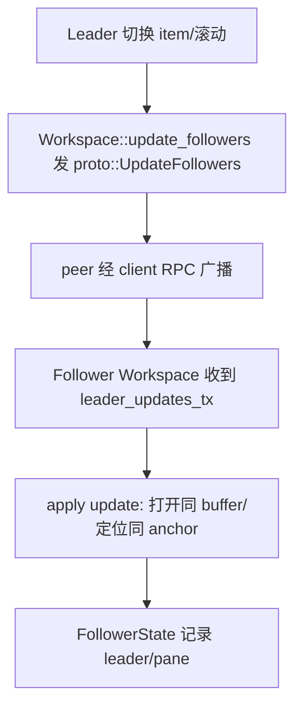
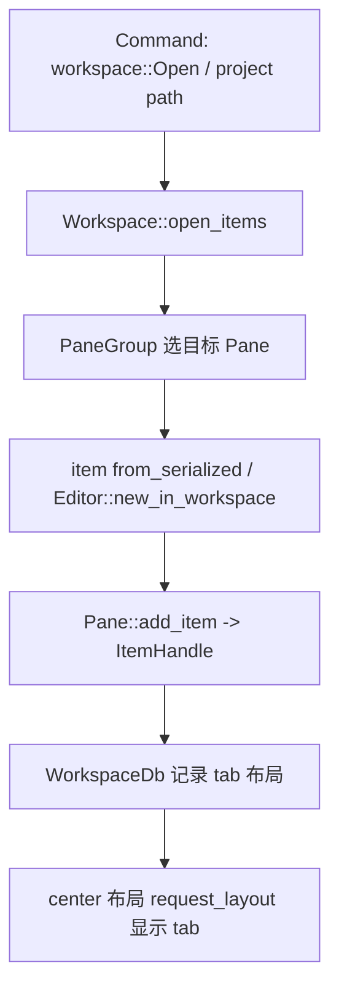

# Deep Reference: workspace

> 参考手册级：`crates/workspace`。`Workspace` 是**一个窗口内的顶层布局/协作/持久化根**：中央 `PaneGroup`（可分栏的标签页组）+ 左/右/下三个 `Dock` + `StatusBar` + `ModalLayer`/`ToastLayer`。它定义 `trait Item`——**所有可打开的东西（editor、terminal、debug、image、markdown preview…）的统一契约**。`workspace.rs` 达 20000 行。

## 1. `struct Workspace`（[workspace.rs:1581](../crates/workspace/src/workspace.rs)）——字段全景
### 布局
| 字段 | 类型 | 说明 |
|---|---|---|
| `center` | `PaneGroup` | 中心区的**pane 二叉分割树**（`split.rs`/`pane_group.rs`） |
| `panes` | `Vec<Entity<Pane>>` | 全部 pane |
| `panes_by_item` | `HashMap<EntityId,WeakEntity<Pane>>` | item→所在 pane |
| `active_pane` | `Entity<Pane>` | 当前焦点 pane |
| `left_dock`/`bottom_dock`/`right_dock` | `Entity<Dock>` | 三个停靠区 |
| `zoomed`/`zoomed_position`/`maximized_pane` | | 放大某 dock/pane |
| `status_bar` | `Entity<StatusBar>` | 底部状态栏（`StatusItemView` 宿主） |
| `modal_layer` | `Entity<ModalLayer>` | 模态框层（`cx.window.push_root`/`OpenModal`） |
| `toast_layer`/`notifications` | | 通知/吐司 |
| `titlebar_item` | `Option<AnyView>` | 自定义标题栏 |
| `bounds` | `Bounds<Pixels>` | 窗口尺寸（持久化） |
| `region_focus_handles` | `RegionFocusHandles` | 各区域 focus 循环（`ToggleSidebar`/焦点切换） |

### 状态与依赖
| 字段 | 类型 | 说明 |
|---|---|---|
| `project` | `Entity<Project>` | 关联项目（[Project-Deep-Dive.md](Project-Deep-Dive.md)） |
| `app_state` | `Arc<AppState>` | 全局服务（fs/db/client/node…，[Startup-Flow.md](Startup-Flow.md)） |
| `database_id` | `Option<WorkspaceId>` | DB 行 id（恢复布局） |
| `session_id` | `Option<String>` | 本次启动会话 |
| `terminal_provider`/`debugger_provider` | `dyn` trait | 可注入的终端/调试后端 |
| `on_prompt_for_new_path`/`_open_path` | | 文件对话框钩子 |
| `multi_workspace` | | 多工作区 |

### 协作（follower/leader）
`collaborators`（在 project）、`follower_states: HashMap<CollaboratorId,FollowerState>`、`last_leaders_by_pane`、`leader_updates_tx`、`active_call: GlobalAnyActiveCall`、`auto_watch`。跟随逻辑：`follow_leader`/`update_followers`（见 §5）。

## 2. `trait Item`（[item.rs:170](../crates/workspace/src/item.rs)）——统一契约
> `Item: Focusable + EventEmitter<Self::Event> + Render + Sized`。任何 tab 内容都实现它。
| 方法 | 位置 | 作用 |
|---|---|---|
| `tab_content(TabContentParams,..)->AnyElement` | [L177](../crates/workspace/src/item.rs) | 标签页外观 |
| `tab_tooltip_text` | [L202](../crates/workspace/src/item.rs) | 悬停提示 |
| `project_path(cx)->Option<ProjectPath>` | [L497](../crates/workspace/src/item.rs) | 关联文件（标题/最近项目） |
| `activation_path` / `priority_name` / `local_selected_text` | item.rs | 定位/命名/复制 |
| `is_dirty(cx)` | [L279](../crates/workspace/src/item.rs) | 未保存标记 |
| `save(save_intent,..)->Task<Result<()>>` | [L301](../crates/workspace/src/item.rs) | 保存（`SaveIntent::Keep`/`Update`） |
| `save_deprecated` | item.rs | 旧式保存 |
| `navigate(Arc<dyn Any+Send>,..)` | [L525](../crates/workspace/src/item.rs) | 跳转（供 project search/call hierarchy 打开并定位） |
| `to_item_handle` / `from_item_handle` | item.rs | 类型擦除↔具体 |
| `to_serialized_item(cx)->Option<SerializedItem>` | item.rs | 持久化（§4） |
| `from_serialized_item(..)` | item.rs | 恢复 |
| `should_add_to_navigation_history` / `should_save_on_close` | item.rs | 历史/关闭保存 |
| `act-on`：`added_to_workspace`/`removed`/`retained` | item.rs | 生命周期回调 |
`trait ItemHandle`(L484) 是类型擦除版；`Item` 提供 blanket `to_item_handle`。

### 相关 trait
| trait | 位置 | 说明 |
|---|---|---|
| `trait SearchableItem` | [searchable.rs:73](../crates/workspace/src/searchable.rs) | 实现查找/替换 UI 接线（`SearchEvent`、`match_found`、`replace_all`） |
| `trait SearchableItemHandle` | [searchable.rs:211](../crates/workspace/src/searchable.rs) | 擦除版 |
| `trait ListItem`/`ListSubItem` | list.rs | 列表行渲染（picker 用） |
| `trait ToolbarItem` | toolbar.rs | 编辑器工具栏项 |
| `trait DraggedItem`/`drag` | workspace drag | 拖放分栏 |
| `trait SerializableItem` | persistence | 可写入 DB 的 item |

## 3. `Pane`（[pane.rs:399](../crates/workspace/src/pane.rs)）
一个**标签页容器**：`items: Vec<Box<dyn ItemHandle>>`、`active_item: Option<EntityId>`、`pinned/split`、预览标签（`Preview` 单占位）、导航历史、`add_item`/`activate_item`/`close_item`/`save_item`/`split`/`zoom`。`PaneGroup` 管理 pane 间的二分切割与键盘导航（`ActivatePaneUp`…）。

## 4. 持久化（[persistence.rs:536](../crates/workspace/src/persistence.rs) + `persistence/model.rs`）
- `struct WorkspaceDb(ThreadSafeConnection)`(L536)：SQLite（[Persistence.md](Persistence.md)）。
- `struct ItemDb`：存 `SerializedItem`/`SerializedPane`/`SerializedWorkspace`/`SerializedTabs`（model.rs 的 `DockStructure`(L154)/`DockData`(L204) 存 dock 布局）。
- 恢复：启动时 `WorkspaceDb::workspaces(app_db)` 读回，按 `from_serialized_item` 重建 tabs（editor 用 [Editor 的 persistence.rs](Editor-Deep-Dive.md) 存 buffer 顺序）。
- 写入是异步串行化：`serializable_items_tx` + `_items_serializer` task（避免阻塞）。

## 5. 协作跟随（leader/follower）

`auto_watch`：无人跟随时自动跟随最近活动。

## 6. 事件与操作
- `Workspace::Event`（workspace.rs）：`ModalAdded/Removed`、`ToastAdded`、`ZoomChanged`、`ActivePaneChanged`、`ItemDroppedFrom`、`TitlebarItemChanged`、`WorkspaceCreated`…
- 大量 `Action` 在 workspace.rs 底部（`NewFile`、`CloseAll`、`ToggleSidebar`、`ActivateNextPane`、`Follow`、`Restart`）。→ [Picker-and-Commands.md](Picker-and-Commands.md)。

## 7. 典型：`open_uri` 到出现 tab

## 8. 相关页
[Project-Deep-Dive.md](Project-Deep-Dive.md)、[Editor-Deep-Dive.md](Editor-Deep-Dive.md)、[GPUI-Deep-Dive.md](GPUI-Deep-Dive.md)、[Workspace-Pane-Dock.md](Workspace-Pane-Dock.md)、[Collaboration-and-Call.md](Collaboration-and-Call.md)、[Persistence.md](Persistence.md)。
