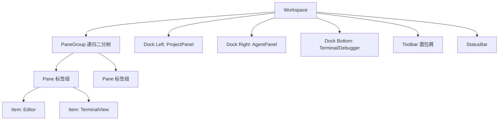
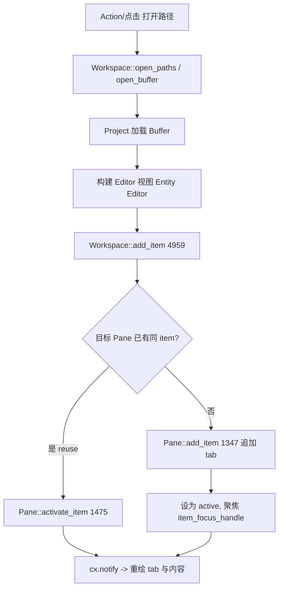

# Workspace / Pane / Dock（应用外壳与 Item 系统）

`Workspace` 是 Zed 窗口的**根视图与状态中枢**——所有编辑器、终端、调试面板、侧栏都挂在它下面。相关 crate：[`workspace`](../crates/workspace)，核心文件体量极大：`workspace.rs`（约 757KB）、`pane.rs`（约 366KB）、`persistence.rs`（约 230KB）、`item.rs`、`dock.rs`、`pane_group.rs`。

## 1. 层级结构

- **`Workspace`**（[`workspace.rs:1581`](../crates/workspace/src/workspace.rs)）：持有 `weak_self`、根 `PaneGroup`、三个 `Dock`（左/右/下）、活动 pane、`database_id`（持久化主键，L7506）。
- **`PaneGroup`**（`pane_group.rs`）：可**递归二分**的布局树，叶子是 `Pane`。`split_pane`（L6206）在某个方向分裂出新 pane。
- **`Pane`**（[`pane.rs:399`](../crates/workspace/src/pane.rs)）：一组标签页（tab），内部 `items: Vec<Box<dyn ItemHandle>>` + `active_item_index`。
- **`Item`**（[`item.rs:170`](../crates/workspace/src/item.rs)）：任何"可放进 Pane 的视图"的抽象（Editor、终端、预览……）。
- **`Dock`**（[`dock.rs:283`](../crates/workspace/src/dock.rs)）+ `DockPosition`（L324：Left/Right/Bottom）：承载可折叠的 `Panel`。

## 2. Item 系统（外壳的关键抽象）

`Item` 要求实现者同时是 `Focusable + EventEmitter<Self::Event> + Render`（item.rs:170）——即"可聚焦 + 可发事件 + 可渲染"三合一，并定义：
- `tab_content()`（L177/L484）：绘制标签页（文件名、dirty 点、图标）。
- `tab_content_text()` / `tab_tooltip_text()`（L485/L488）：标签文本与悬浮提示。
- 关联 `type Event`（如 `ItemEvent`，L122：`CloseItem`/`UpdateTab`/…）驱动 pane 响应。

因为 Pane 需要**异构存储**这些 item，`item.rs` 又定义对象安全的 **`ItemHandle`**（L476）：`item_focus_handle()`(L477)、`subscribe_to_item_events()`(L478) 等，由 `Entity<T: Item>` 自动实现（L629/L648 的 blanket impl），Pane 里存的就是 `Box<dyn ItemHandle>`。

## 3. 打开文件 → 出现标签页的调用流程

对应真实机制：
1. **入口**：命令面板 `editor: Open File`、project panel 双击、`cmd+t` 等，最终调用 `Workspace` 的 open 系列方法拿到 `Entity<Editor>`（Editor 实现了 `Item`）。
2. **`Workspace::add_item`（L4959）**：决定放入哪个 pane（可能带 `Split`/`Replace`/`Reuse` 等 `AddItem` 选项），必要时新建 pane。
3. **`Pane::add_item`（L1347）**：把 `Box<dyn ItemHandle>` 插进 `items`，处理"同路径已打开则复用"的去重。
4. **激活与聚焦**：`Pane::activate_item`（L1475）设 `active_item_index`，并 `item.item_focus_handle()` 取焦点；`Workspace::activate_item`（L5560）负责跨 pane/panel 的全局激活。
5. **渲染**：Pane 作为 `Render` 元素，把活动 item 的 `render` 嵌进内容区；任何状态变化通过 `cx.notify()` 触发 GPUI 重绘（见 [GPUI.md](GPUI.md)）。

## 4. Dock 与 Panel（侧栏 / 底部栏）

- 每个 `Dock` 有一个 `position`（L509 `position()`），内含当前 `Panel`（如 `ProjectPanel`、`DebugPanel`、终端面板）。
- 折叠/展开：`toggle_panel_flexible_size`（L1056）等；`toggle_action()`（L1212）按位置返回对应 Action（如 `project_panel::ToggleFocus`）。
- Panel 本身也是可 focus 的视图，参与 GPUI 焦点环；`is_open`（L513）控制显隐。

## 5. 持久化与重启恢复

[`persistence.rs`](../crates/workspace/src/persistence.rs)（约 230KB）把整个工作区（打开的 pane 树、每个 item 的路径/光标/选区、dock 状态）序列化进 **SQLite**（`db` crate），重启时反序列化重建：
- 每个 `Item` 提供序列化描述（`Item::to_item_serialization` 一类），记录"类型名 + 参数"。
- 恢复时按类型名查注册的 **构造器**（`Builder`），回调对应 crate 注册的工厂函数重建视图。因此某 crate 若想让自定义 tab 能被恢复，必须在工作区注册其 item 类型。
- `database_id`（L7506）标识该 workspace 行，用于多窗口 / 重启后归属。

## 6. 关键符号速查

| 符号 | 位置 | 作用 |
|---|---|---|
| `Workspace` | `workspace/src/workspace.rs:1581` | 窗口根状态与视图 |
| `Workspace::add_item` | `workspace.rs:4959` | 把 item 放进某 pane（含分裂/复用策略） |
| `Workspace::activate_item` | `workspace.rs:5560` | 跨 pane/panel 激活并聚焦 item |
| `Workspace::split_pane` | `workspace.rs:6206` | 方向性分裂 pane |
| `Pane` | `workspace/src/pane.rs:399` | 一组标签页 |
| `Pane::add_item` / `activate_item` | `pane.rs:1347` / `1475` | 追加/切换 tab |
| `Item` trait | `workspace/src/item.rs:170` | 可放 Pane 的视图抽象 |
| `ItemHandle` | `item.rs:476` | 对象安全擦除，Pane 异构存储用 |
| `Dock` / `DockPosition` | `dock.rs:283` / `324` | 侧/底可折叠面板容器 |
| `persistence.rs` | `workspace/src/persistence.rs` | 工作区 SQLite 序列化与恢复 |

## 7. 与其他页面的关系
- Pane 里的主要内容是编辑器：[Editor.md](Editor.md)；终端 item 见 [Terminal.md](Terminal.md)。
- 打开文件依赖语言/项目：[Language-and-Project.md](Language-and-Project.md)。
- dock 中的 Agent 面板：[Agent-and-AI.md](Agent-and-AI.md)。
- 渲染与焦点机制：[GPUI.md](GPUI.md)、[GPUI-Internals.md](GPUI-Internals.md)。
